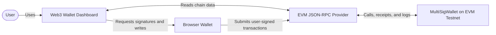
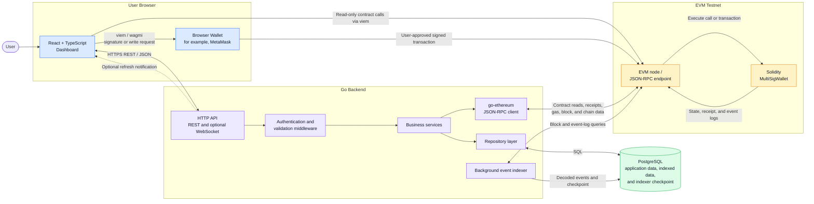
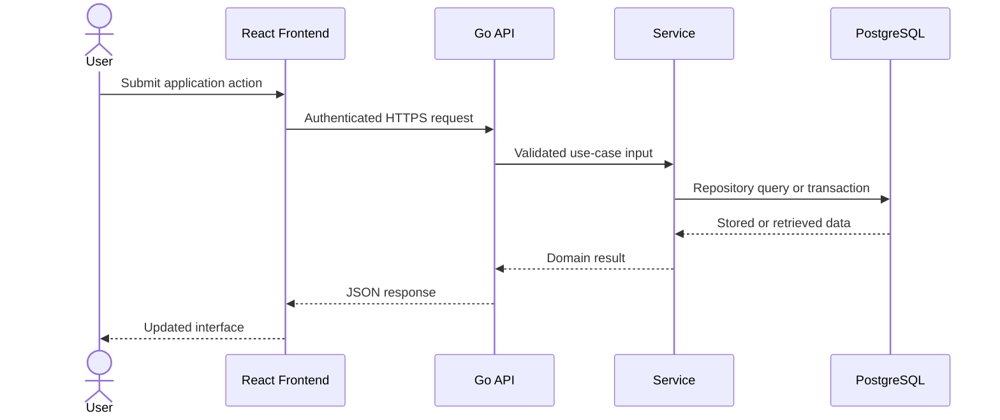
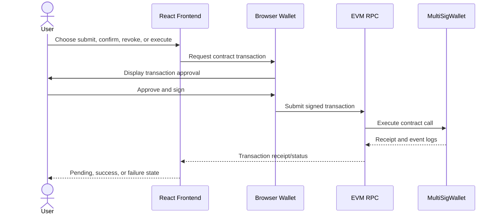
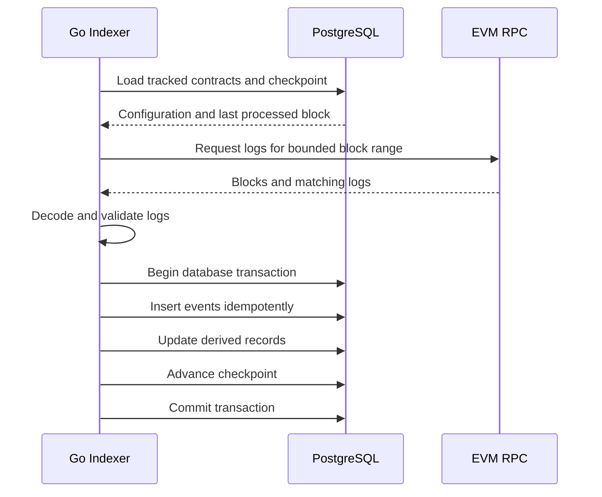

# System Architecture

## Status

This document describes the planned architecture of the Web3 Wallet Dashboard. At the current milestone, only the initial Go HTTP server, router, health endpoint, and associated tests are implemented.

## Architectural objective

The system combines off-chain application data with on-chain multisig activity while preserving a clear trust boundary: application records are managed by the Go API, and state-changing blockchain transactions are approved and signed by the user's browser wallet.

The architecture supports three primary data paths:

1. **Off-chain application path:** React → Go REST API → PostgreSQL.
2. **On-chain interaction path:** React → browser wallet or viem public client → EVM JSON-RPC → `MultiSigWallet`.
3. **Indexing path:** Go indexer → EVM JSON-RPC → PostgreSQL → Go REST API → React.

## System context



## Container architecture



## Component responsibilities

### React and TypeScript dashboard

Responsibilities:

- Render authentication, wallet, contract, transaction, and event screens.
- Call the Go REST API through a typed client.
- Manage loading, empty, error, pending, success, and failure states.
- Connect to the browser wallet through viem and wagmi.
- Detect the connected account and chain.
- Perform selected public contract reads.
- Request user approval for state-changing contract calls.
- Refresh indexed dashboard data after on-chain activity.

The frontend must not present a submitted wallet request as successful until the resulting EVM transaction receipt confirms success.

### Browser wallet

Responsibilities:

- Hold the user's private keys outside the application.
- Display transaction details for user approval.
- Sign approved transactions locally.
- Submit signed transactions to the configured EVM network.

The Go backend must not receive seed phrases or private keys.

### Go HTTP API

Responsibilities:

- Route HTTP requests.
- Authenticate protected requests.
- Validate and deserialize input.
- Invoke business services.
- Serialize consistent success and error responses.
- Expose pagination and filtering for collection endpoints.
- Expose liveness and readiness checks.
- Optionally emit refresh notifications after the REST and indexer flows are stable.

Handlers should remain thin and must not contain persistence or EVM-specific business logic.

### Authentication and validation middleware

Responsibilities:

- Establish authenticated application-user identity.
- Reject missing or invalid authentication.
- Attach request-scoped identity and metadata to the Go context.
- Enforce request-level concerns before handlers invoke services.

Record ownership authorization remains a service or repository-query responsibility and must not rely only on route middleware.

### Business services

Responsibilities:

- Implement application use cases.
- Enforce ownership and domain rules.
- Coordinate repositories and the chain client.
- Translate persistence and RPC failures into application-level errors.
- Define transaction boundaries where multiple writes must succeed together.

Services must not depend on HTTP-specific request or response types.

### Repository layer

Responsibilities:

- Execute PostgreSQL queries.
- Map database records into domain or persistence models.
- Apply user-ownership conditions to protected queries.
- Support transactions needed for atomic updates.
- Surface duplicate, missing-record, and database failures in a form services can interpret.

Repositories must not implement HTTP response behavior.

### go-ethereum chain client

Responsibilities:

- Connect to a configured EVM JSON-RPC endpoint.
- Verify the expected chain ID.
- Load and use the `MultiSigWallet` ABI.
- Read owners, thresholds, transaction counts, and transaction state.
- Retrieve blocks, logs, receipts, and gas information required by backend use cases.
- Decode RPC errors into chain-boundary errors.

The chain client does not hold user private keys and is not responsible for signing browser-user transactions.

### Background event indexer

Responsibilities:

- Discover tracked contracts and their indexing start points.
- Load the stored checkpoint.
- Query bounded block ranges.
- Filter and decode supported contract events.
- Persist events idempotently.
- Derive normalized multisig transaction and confirmation data where appropriate.
- Advance checkpoint state only after event persistence succeeds.
- Retry transient RPC failures with bounded backoff.
- Stop cleanly when the application is shutting down.

The initial indexer is a Go background component. It may later run as a separate process using the same internal packages, but a message queue is not required for the initial version.

### PostgreSQL

Planned responsibilities:

- Application users and authentication data
- Saved wallet addresses
- Tracked contracts and chain metadata
- Multisig transactions and confirmations
- Decoded contract events
- Indexer checkpoint state
- Idempotency identifiers

PostgreSQL is the source of truth for off-chain application records and indexed dashboard views. The EVM chain remains the source of truth for contract state.

### EVM JSON-RPC endpoint

Responsibilities:

- Accept public contract calls and user-signed transactions.
- Return block, receipt, gas, chain, and log data.
- Expose the EVM testnet where the `MultiSigWallet` is deployed.

The application must handle RPC timeouts, provider rate limits, transient failures, and chain mismatches.

### Solidity MultiSigWallet

Responsibilities are defined by the existing contract and ABI. The intended application flow depends on support for:

- Owner and threshold reads
- Transaction submission
- Confirmation
- Confirmation revocation
- Execution
- Events sufficient to reconstruct or display relevant activity

Contract capabilities and event signatures must be verified against the existing source before the API, frontend, and indexer schemas are finalized.

## Data flows

### 1. Off-chain application flow



This flow manages application users, saved wallets, tracked contracts, and queries over indexed data.

### 2. On-chain write flow



The browser wallet owns the signing boundary. The Go API may track or read the transaction but does not sign it.

### 3. Contract-read flow

Public state may be read through either path:

- React → viem → EVM JSON-RPC for direct user-interface reads.
- Go service → go-ethereum client → EVM JSON-RPC for backend normalization, validation, receipts, and indexed workflows.

The application must identify whether displayed data is a direct chain read or an eventually consistent indexed database view.

### 4. Event-indexing flow



If persistence fails, the checkpoint must not advance. Reprocessing the range must not create duplicates.

### 5. Indexed-dashboard flow

1. React requests indexed transactions or events from the Go API.
2. The API applies authentication, ownership, filtering, and pagination.
3. The repository queries PostgreSQL.
4. The API returns typed JSON data.
5. React renders the current indexed view.
6. React initially polls or refreshes after a transaction receipt. Optional WebSocket notification may later signal that fresh indexed data is available.

## Initial persistence model

The detailed design belongs in `database-schema.md`, but the initial architecture expects these entities:

- `users`
- `wallets`
- `tracked_contracts`
- `multisig_transactions`
- `transaction_confirmations`
- `contract_events`
- `indexed_blocks` or an equivalent checkpoint table

Likely event uniqueness inputs:

- Chain ID
- Transaction hash
- Log index

The final unique constraints must be chosen before indexer implementation.

## Trust boundaries

### Browser trust boundary

- Private keys remain in the browser wallet.
- The frontend must treat connected account and chain as changeable state.
- The UI must display contract address, network, action, and transaction status clearly.

### API trust boundary

- Every external request is untrusted.
- Authentication does not replace per-record authorization.
- User-controlled addresses, filters, identifiers, and pagination inputs require validation.
- Errors must not expose secrets or internal database details.

### Database trust boundary

- Database constraints reinforce application invariants.
- Sensitive authentication data must be stored using an appropriate one-way password hash or secure session representation.
- Credentials and connection strings remain outside source control.

### RPC trust boundary

- RPC responses may be delayed, unavailable, rate-limited, or associated with the wrong chain.
- The backend and frontend must verify chain ID.
- Indexed data is eventually consistent and may require basic reorganization handling.

### Contract trust boundary

- The existing contract source, ABI, events, access controls, and Foundry tests must be reviewed before integration.
- Frontend authorization hints are not security controls; the Solidity contract enforces on-chain authorization.

## Failure handling

### HTTP API

- Validate input before service invocation.
- Use consistent application error codes and HTTP statuses.
- Add request timeouts and propagate context cancellation.
- Recover from unexpected handler panics without exposing internals.

### PostgreSQL

- Use transactions for atomic multi-record changes.
- Map uniqueness and foreign-key failures consistently.
- Add integration tests against a real PostgreSQL instance.

### EVM RPC

- Apply explicit timeouts.
- Retry only transient failures and use bounded backoff.
- Do not blindly retry state-changing user operations.
- Map common RPC and receipt failures into user-readable states.

### Indexer

- Process bounded ranges to avoid oversized RPC requests.
- Persist events and checkpoint changes atomically.
- Make insertion idempotent.
- Log chain, contract, block range, and error context.
- Resume from the last successful checkpoint after restart.

## Deployment shape

The initial deployment is intentionally simple:

```text
Static React frontend
        |
        v
Single Go application deployment
  |-- REST API
  |-- background indexer
  |-- go-ethereum client
        |
        +--> Managed PostgreSQL
        +--> EVM JSON-RPC provider

MultiSigWallet deployed and verified on an EVM testnet
```

A separate indexer process may be considered if operational requirements justify it. It is not required for the initial portfolio version.

## Architectural decisions and scope guards

- Keep one monorepo for frontend, backend, contracts, documentation, and CI.
- Use standard-library HTTP concepts before adding a framework.
- Use REST before optional WebSocket notifications.
- Use one Go indexer; do not create duplicate indexing components.
- Do not add RabbitMQ, Kafka, Redis, or microservices without evidence that the simpler design is insufficient.
- Use viem and wagmi in the frontend and go-ethereum in the backend.
- Use PostgreSQL as the initial persistent store.
- Use a browser wallet for all user transaction signing.
- Target a testnet before any mainnet consideration.

These decisions may later receive individual Architecture Decision Records in `docs/adr/`.

## Known limitations

- Only the health endpoint is implemented at the time this document is first written.
- Authentication design is not finalized.
- The exact PostgreSQL schema and API contracts are not finalized.
- The target testnet and RPC provider are not finalized.
- Contract event coverage must be checked against the existing ABI.
- Deep chain-reorganization handling is outside the initial scope.
- Indexed dashboard data may lag direct chain state.
- Optional WebSocket behavior is not defined and is not required for the first working version.

## Open decisions

1. Session-cookie or bearer-token authentication.
2. Target EVM testnet and RPC provider.
3. Exact contract events and any required contract updates.
4. Indexer confirmation depth and basic reorganization policy.
5. Whether readiness checks include PostgreSQL and RPC connectivity.
6. Whether the API exposes normalized contract reads in addition to direct frontend reads.
7. Whether optional real-time updates use WebSocket or server-sent events.
8. Whether the indexer remains in the API process or uses a separate executable at deployment time.
