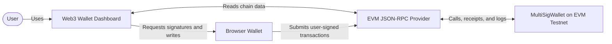
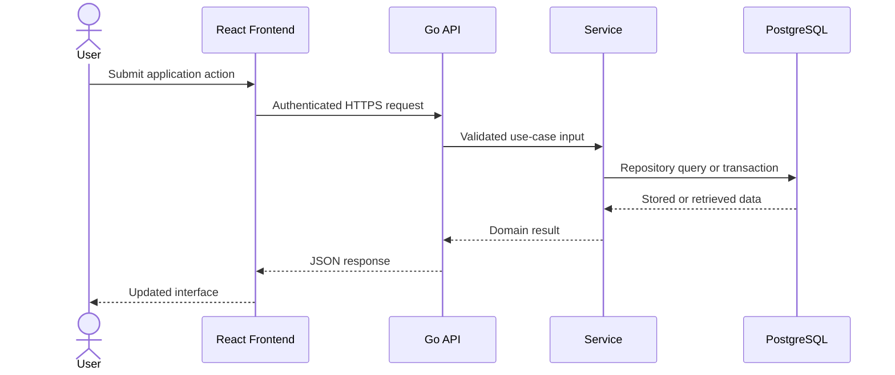
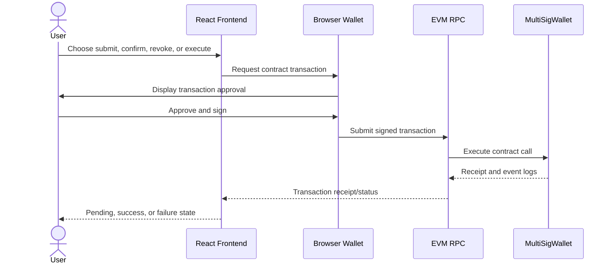
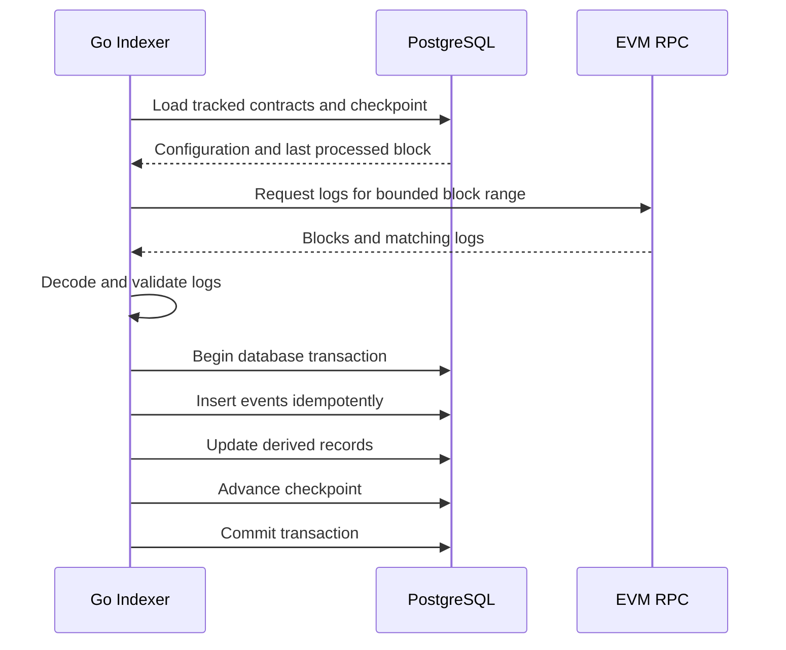

# System Architecture

## Status

This document describes the target architecture of the Web3 Wallet Dashboard. The Go backend currently implements bearer-token authentication, wallet CRUD, supported-chain metadata, tracked-contract CRUD, a read-only EVM client in `backend/internal/evm`, and the contract indexer in `backend/internal/indexer`: the persistence layer from migration `0008` and the scanner that advances its checkpoints, wired into the API process behind an optional `EVM_RPC_URL`. The scanner retries classified transport failures and corrects a reorganized chain by comparing stored block hashes with canonical ones, and the API exposes the indexed events of a tracked contract and the deployment's indexing availability at read time. The React frontend remains planned, so diagrams and flows below describe the target architecture unless marked as implemented.

## Architectural objective

The system combines off-chain application data with on-chain multisig activity while preserving a clear trust boundary: application records are managed by the Go API, and state-changing blockchain transactions are approved and signed by the user's browser wallet.

The architecture supports three primary data paths:

1. **Off-chain application path:** React → Go REST API → PostgreSQL.
2. **On-chain interaction path:** React → browser wallet or viem public client → EVM JSON-RPC → `MultiSigWallet`.
3. **Indexing path:** Go indexer → EVM JSON-RPC → PostgreSQL → Go REST API → React.

## System context


```mermaid
flowchart LR
    USER([User])
    APP[Web3 Wallet Dashboard]
    WALLET[Browser Wallet]
    RPC[EVM JSON-RPC Provider]
    CONTRACT[MultiSigWallet on EVM Testnet]

    USER -->|Uses| APP
    APP -->|Requests signatures and writes| WALLET
    APP <-->|Reads chain data| RPC
    WALLET -->|Submits user-signed transactions| RPC
    RPC <-->|Calls, receipts, and logs| CONTRACT
```

## Container architecture


```mermaid
flowchart LR
    USER([User])

    subgraph BROWSER["User Browser"]
        FE["React + TypeScript<br/>Dashboard"]
        WALLET["Browser Wallet<br/>for example, MetaMask"]
        FE -->|"viem / wagmi<br/>signature or write request"| WALLET
    end

    subgraph BACKEND["Go Backend"]
        API["HTTP API<br/>REST and optional WebSocket"]
        AUTH["Authentication and<br/>validation middleware"]
        SERVICE["Business services"]
        REPO["Repository layer"]
        CHAIN["go-ethereum<br/>JSON-RPC client"]
        INDEXER["Background event indexer"]

        API --> AUTH
        AUTH --> SERVICE
        SERVICE --> REPO
        SERVICE --> CHAIN
    end

    DB[("PostgreSQL<br/>application data, indexed data,<br/>and indexer checkpoint")]

    subgraph EVM["EVM Testnet"]
        RPC["EVM node /<br/>JSON-RPC endpoint"]
        CONTRACT["Solidity<br/>MultiSigWallet"]

        RPC -->|"Execute call or transaction"| CONTRACT
        CONTRACT -->|"State, receipt, and event logs"| RPC
    end

    USER --> FE

    FE <-->|"HTTPS REST / JSON"| API
    API -.->|"Optional refresh notification"| FE

    REPO <-->|"SQL"| DB

    FE -->|"Read-only contract calls via viem"| RPC
    WALLET -->|"User-approved signed transaction"| RPC
    CHAIN <-->|"Contract reads, receipts,<br/>gas, block, and chain data"| RPC
    INDEXER <-->|"Block and event-log queries"| RPC
    INDEXER -->|"Decoded events and checkpoint"| DB

    classDef browser fill:#dbeafe,stroke:#2563eb,color:#111827;
    classDef backend fill:#ede9fe,stroke:#7c3aed,color:#111827;
    classDef database fill:#dcfce7,stroke:#16a34a,color:#111827;
    classDef chain fill:#fef3c7,stroke:#d97706,color:#111827;

    class FE,WALLET browser;
    class API,AUTH,SERVICE,REPO,CHAIN,INDEXER backend;
    class DB database;
    class RPC,CONTRACT chain;
```

## Component responsibilities

### React and TypeScript dashboard

Responsibilities:

- Render authentication, wallet, contract, transaction, and event screens.
- Call the Go REST API through a typed client.
- Manage loading, empty, error, pending, success, and failure states.
- Connect to the browser wallet through viem and wagmi.
- Detect the connected account and chain.
- Perform selected public contract reads.
- Request user approval for state-changing contract calls.
- Refresh indexed dashboard data after on-chain activity.

The frontend must not present a submitted wallet request as successful until the resulting EVM transaction receipt confirms success.

### Browser wallet

Responsibilities:

- Hold the user's private keys outside the application.
- Display transaction details for user approval.
- Sign approved transactions locally.
- Submit signed transactions to the configured EVM network.

The Go backend must not receive seed phrases or private keys.

### Go HTTP API

Responsibilities:

- Route HTTP requests.
- Authenticate protected requests.
- Validate and deserialize input.
- Invoke business services.
- Serialize consistent success and error responses.
- Expose pagination and filtering for collection endpoints.
- Expose liveness and readiness checks.
- Optionally emit refresh notifications after the REST and indexer flows are stable.

Handlers should remain thin and must not contain persistence or EVM-specific business logic.

### Authentication and validation middleware

Responsibilities:

- Establish authenticated application-user identity.
- Reject missing or invalid authentication.
- Attach request-scoped identity and metadata to the Go context.
- Enforce request-level concerns before handlers invoke services.

Record ownership authorization remains a service or repository-query responsibility and must not rely only on route middleware.

### Business services

Responsibilities:

- Implement application use cases.
- Enforce ownership and domain rules.
- Coordinate repositories and the chain client.
- Translate persistence and RPC failures into application-level errors.
- Define transaction boundaries where multiple writes must succeed together.

Services must not depend on HTTP-specific request or response types.

### Repository layer

Responsibilities:

- Execute PostgreSQL queries.
- Map database records into domain or persistence models.
- Apply user-ownership conditions to protected queries.
- Support transactions needed for atomic updates.
- Surface duplicate, missing-record, and database failures in a form services can interpret.

Repositories must not implement HTTP response behavior.

### go-ethereum chain client

Responsibilities:

Implemented in `backend/internal/evm`:

- Connect to a configured EVM JSON-RPC endpoint and verify the expected chain ID.
- Use the `MultiSigWallet` ABI for read-only owner, threshold, transaction-count, ownership, transaction, and confirmation reads.
- Return transaction receipt metadata, including its transaction hash, block identity, status, and gas used. Failed execution is represented by receipt status, not as a lookup error.
- Estimate gas for a call by RPC simulation and return gas units only. Estimation does not sign or submit a transaction.
- Decode RPC errors into chain-boundary errors.

`MultiSigReader` uses go-ethereum's ABI codec inside the package. Its consumer-side `ChainReader` seam carries plain Go values and byte slices. Transaction and confirmation reads capture one block and use it for every related call. `Client.TransactionReceipt` maps an unavailable receipt to `ErrReceiptNotFound`; that error does not distinguish a pending transaction from an unknown hash. `Client.EstimateGas` validates and copies its inputs before the reader call. `Client.BlockHeader` and `Client.BlockHeaders` read block identity, the batched form issuing one JSON-RPC batch call and returning headers in request order. `Client.FilterLogs` reads the decoded-input logs for one contract over an inclusive block range and the four supported event topics, returning the plain-Go `RawLog` the event decoder consumes. A missing block maps to `ErrBlockNotFound`, and a returned log outside the requested range or from another emitter is rejected rather than stored. Every read takes the caller's context, makes one attempt, and does not retry, time out or subscribe.

The indexer's scanner consumes these reads through its own `ChainReader` seam. The reliability policy below, retry and reorganization recovery, is implemented at that seam, and HTTP exposure of indexed data is implemented in `httpapi`. Event decoding and log retrieval are implemented in `internal/evm`. The client does not hold user private keys and is not responsible for signing browser-user transactions.

### Background event indexer

Implemented in `backend/internal/indexer` for the scan path. The job runs as a periodic worker inside the API process and:

- Reads the watch set from `contracts` rows that are enabled for indexing, together with the chain each deployment belongs to.
- Loads the stored checkpoint for one deployment at a time and scans a bounded range of at most 100 blocks.
- Derives a safe head of `latest - 11`, which is 12 confirmations including the head block, and never scans past it.
- Filters and decodes the four supported `MultiSigWallet` events.
- Persists events idempotently through the repository, which derives normalized multisig transactions and confirmations in the same transaction.
- Advances checkpoint state only after event persistence succeeds.
- Retries one range operation after a classified transient transport failure, at most twice more.
- Compares the stored last indexed block with the canonical header on every rotation turn and rewinds to the common ancestor when the chain has moved.
- Resumes from the last committed checkpoint after a restart.
- Stops cleanly when the application is shutting down.

`safe` or `finalized` block tags are not used, and the confirmation window is not treated as finality.

The reorganization check costs one canonical header read per contract that has a stored tip, on every rotation turn, whether or not the chain moved: the stored last indexed hash is compared with the header for that height before a contract is considered caught up. A contract with no stored tip yet is skipped without a request, and the walk that follows a mismatch stays bounded by the stored block rows above the ancestor.

The indexer is a Go background component. It may later run as a separate process using the same internal packages, but a message queue is not required for the initial version.

### PostgreSQL

Responsibilities, all implemented:

- Application users and authentication data, saved wallet addresses, tracked contracts and chain metadata, from migrations `0001` to `0007`.
- Multisig transactions and confirmations, decoded contract events, indexed block rows and indexer checkpoint state, from migration `0008`.

Idempotency does not have its own column. A stored event is identified by its occurrence, `(contract_id, block_hash, log_index)`, which is what makes a replayed range a no-op and what keeps a transaction that is re-included on another fork from colliding with the row it orphaned.

PostgreSQL is the source of truth for off-chain application records and indexed dashboard views. The EVM chain remains the source of truth for contract state.

### EVM JSON-RPC endpoint

Responsibilities:

- Accept public contract calls and user-signed transactions.
- Return block, receipt, gas, chain, and log data.
- Expose the EVM testnet where the `MultiSigWallet` is deployed.

The application must handle RPC timeouts, provider rate limits, transient failures, and chain mismatches.

### Solidity MultiSigWallet

Responsibilities are defined by the existing contract and ABI. The intended application flow depends on support for:

- Owner and threshold reads
- Transaction submission
- Confirmation
- Confirmation revocation
- Execution
- Events sufficient to reconstruct or display relevant activity

Contract capabilities and event signatures must be verified against the existing source before the API, frontend, and indexer schemas are finalized.

## Data flows

### 1. Off-chain application flow


```mermaid
sequenceDiagram
    actor User
    participant FE as React Frontend
    participant API as Go API
    participant SVC as Service
    participant DB as PostgreSQL

    User->>FE: Submit application action
    FE->>API: Authenticated HTTPS request
    API->>SVC: Validated use-case input
    SVC->>DB: Repository query or transaction
    DB-->>SVC: Stored or retrieved data
    SVC-->>API: Domain result
    API-->>FE: JSON response
    FE-->>User: Updated interface
```

This flow manages application users, saved wallets, tracked contracts, and queries over indexed data.

### 2. On-chain write flow


```mermaid
sequenceDiagram
    actor User
    participant FE as React Frontend
    participant W as Browser Wallet
    participant RPC as EVM RPC
    participant C as MultiSigWallet

    User->>FE: Choose submit, confirm, revoke, or execute
    FE->>W: Request contract transaction
    W->>User: Display transaction approval
    User->>W: Approve and sign
    W->>RPC: Submit signed transaction
    RPC->>C: Execute contract call
    C-->>RPC: Receipt and event logs
    RPC-->>FE: Transaction receipt/status
    FE-->>User: Pending, success, or failure state
```

The browser wallet owns the signing boundary. The Go API may track or read the transaction but does not sign it.

### 3. Contract-read flow

Public state may be read through either path:

- React → viem → EVM JSON-RPC for direct user-interface reads.
- Go service → go-ethereum client → EVM JSON-RPC for backend normalization, validation, receipts, and indexed workflows.

The application must identify whether displayed data is a direct chain read or an eventually consistent indexed database view.

### 4. Event-indexing flow


```mermaid
sequenceDiagram
    participant IDX as Go Indexer
    participant DB as PostgreSQL
    participant RPC as EVM RPC

    IDX->>DB: Load tracked contracts and checkpoint
    DB-->>IDX: Configuration and last processed block
    IDX->>RPC: Request logs for bounded block range
    RPC-->>IDX: Blocks and matching logs
    IDX->>IDX: Decode and validate logs
    IDX->>DB: Begin database transaction
    IDX->>DB: Insert events idempotently
    IDX->>DB: Update derived records
    IDX->>DB: Advance checkpoint
    IDX->>DB: Commit transaction
```

If persistence fails, the checkpoint must not advance. Reprocessing the range must not create duplicates.

### 5. Indexed-dashboard flow

1. React requests indexed transactions or events from the Go API.
2. The API applies authentication, ownership, filtering, and pagination.
3. The repository queries PostgreSQL.
4. The API returns typed JSON data.
5. React renders the current indexed view.
6. React initially polls or refreshes after a transaction receipt. Optional WebSocket notification may later signal that fresh indexed data is available.

## Initial persistence model

The detailed design belongs in `database-schema.md`, but the initial architecture expects these entities:

- `users`
- `wallets`
- `tracked_contracts`
- `multisig_transactions`
- `transaction_confirmations`
- `contract_events`
- `indexed_blocks` or an equivalent checkpoint table

Implemented uniqueness keys in migration `0008`:

- `indexed_blocks`: `(contract_id, block_number)`
- `contract_events`: `(contract_id, block_hash, log_index)`, so a transaction re-included in a different block is a separate occurrence
- `multisig_transactions`: `(contract_id, multisig_tx_index)`
- `transaction_confirmations`: `(multisig_transaction_id, owner_address)`

The watch set is global: `contracts` rows with `indexing_enabled = TRUE` on the Sepolia chain, independent of how many users track a deployment.

## Trust boundaries

### Browser trust boundary

- Private keys remain in the browser wallet.
- The frontend must treat connected account and chain as changeable state.
- The UI must display contract address, network, action, and transaction status clearly.

### API trust boundary

- Every external request is untrusted.
- Authentication does not replace per-record authorization.
- User-controlled addresses, filters, identifiers, and pagination inputs require validation.
- Errors must not expose secrets or internal database details.

### Database trust boundary

- Database constraints reinforce application invariants.
- Sensitive authentication data must be stored using an appropriate one-way password hash or secure session representation.
- Credentials and connection strings remain outside source control.

### RPC trust boundary

- RPC responses may be delayed, unavailable, rate-limited, or associated with the wrong chain.
- The backend and frontend must verify chain ID.
- Indexed data is eventually consistent and may require basic reorganization handling.

### Contract trust boundary

- The existing contract source, ABI, events, access controls, and Foundry tests must be reviewed before integration.
- Frontend authorization hints are not security controls; the Solidity contract enforces on-chain authorization.

## Failure handling

### HTTP API

- Validate input before service invocation.
- Use consistent application error codes and HTTP statuses.
- Add request timeouts and propagate context cancellation.
- Recover from unexpected handler panics without exposing internals.

### PostgreSQL

- Use transactions for atomic multi-record changes.
- Map uniqueness and foreign-key failures consistently.
- Add integration tests against a real PostgreSQL instance.

### EVM RPC

`internal/evm.Client` remains single-attempt. Callers supply contexts and own deadlines; the client adds no hidden timeout or automatic retry. Wrapped cancellation and deadline errors remain discoverable through `errors.Is(err, context.Canceled)` and `errors.Is(err, context.DeadlineExceeded)`.

The indexer retries only clearly classified transient transport failures, with at most 3 attempts total: the initial attempt, a retry after 100 ms, and a final retry after 200 ms. Caller cancellation or deadline expiry stops both calls and backoff waits. Unknown failures are not presumed transient. Validation, wrong-chain, ABI/decode, EVM revert, unknown JSON-RPC, and context errors are not retried. `ErrReceiptNotFound` means no receipt was available at that query; it is not an automatic retry signal.

A retry repeats the whole logical read, including a fresh snapshot block lookup and every related call. Retrying only a failed internal step of a multi-call snapshot is not allowed. Classification and retry execution live in the scanner, not in this client, which stays single-attempt. No signing or transaction submission is introduced.

### Receipt confirmations and reorganizations

When `latestBlockNumber >= receipt.BlockNumber`, count confirmations as `latestBlockNumber - receipt.BlockNumber + 1`. Otherwise the receipt is ahead of the observed head and must not be treated as confirmed; do not subtract unsigned block numbers in that case. These block confirmations are distinct from multisig owner approval flags.

At 12 or more confirmations, the application may treat a receipt as safe for ordinary display or indexing progress. This is a reversible project heuristic, not protocol finality or a guarantee against reorganization. A receipt can vanish or reappear in a different block, so recorded state must remain correctable.

The scanner compares the stored last indexed block hash with the canonical header for the same height before it scans, and does not rely on `RawLog.Removed`, which stays metadata. On a mismatch it walks stored `indexed_blocks` rows down in bounded windows to the highest block whose stored hash still matches, rewinds to that ancestor through the repository, and rescans from `ancestor + 1`. When no stored row matches, it rewinds to the contract's stored start block and rescans inclusively from there. Detection, rewind and rescan are implemented; `safe` or `finalized` block-tag support is not.

### Indexer

- Process bounded ranges to avoid oversized RPC requests.
- Persist events and checkpoint changes atomically.
- Make insertion idempotent.
- Log contract, block range, event count, status and safe head, and sanitize the error text stored on a checkpoint.
- Resume from the last successful checkpoint after restart.

The scanner implements these obligations with one range per run, rotating over the eligible deployments so a busy one cannot starve the others. Every returned log is checked against the fetched block headers before decoding: a log whose block hash disagrees with the header, whose block has no header in the range, or that the endpoint marks removed fails the range instead of being stored. A failed range writes the `error` status and its message to the checkpoint and leaves the checkpoint's next block untouched, so the next tick retries the same range. The status write is detached from the run context, which lets a shutdown or an expiring run still record why it failed. The scanner is sequential: no per-contract goroutines, so concurrent ranges cannot overlap, and the only retries are the bounded ones described above.

Retry covers one whole range operation: the header batch, the log read, decoding and the commit. Nothing else in a run is retried, no status or commit happens between attempts, and the operation is repeated from the start rather than resumed. Classification, the backoff schedule and the attempt count are documented in the reliability policy above. The commit stays inside the retried operation because the repository applies a range idempotently, so a repeated commit of the same range neither duplicates rows nor moves the checkpoint twice.

Reorganization recovery runs when a contract takes its rotation turn, before the range decision, so a checkpoint that looks caught up is corrected too. The stored last indexed block hash is compared with the canonical header for that height; a mismatch starts a walk over stored block rows in windows of at most 100 blocks, each window read in one stored read and one batched header read. The highest block whose stored hash still matches is the common ancestor and becomes the rewind target through `RewindToAncestor`, which marks later events removed, deletes their canonical block rows, rebuilds projections and leaves the checkpoint at `ancestor + 1`. When no stored row matches, `RewindToStart` clears the contract's indexed state and leaves the checkpoint at the stored start block. Both rewinds commit in one transaction, so no reader sees removed events beside projections that still count them. A rewind is logged at warn with the depth, and the same tick continues scanning from the corrected checkpoint when a range is still due.

## Deployment shape

The initial deployment is intentionally simple:

```text
Static React frontend
        |
        v
Single Go application deployment
  |-- REST API
  |-- background indexer
  |-- go-ethereum client
        |
        +--> Managed PostgreSQL
        +--> EVM JSON-RPC provider

MultiSigWallet deployed and verified on an EVM testnet
```

A separate indexer process may be considered if operational requirements justify it. It is not required for the initial portfolio version.

Locally and on a single host the shape is three Compose services built from one image:

- `postgres`, the `postgres:16-alpine` service that already backs local development.
- `migrate`, a one-shot service from the backend image with the command overridden to `migrate up`. It waits for PostgreSQL to report healthy and exits once the schema is current.
- `api`, the same image with the default command, publishing port 8080. It waits for `migrate` to exit successfully, so the API never serves against a schema that has not been brought up to date. Its environment forwards `DATABASE_URL` and `LOG_LEVEL`, plus `EVM_RPC_URL` with an empty default: unsetting the variable is how indexing is left off in a local run, and the value is passed as runtime environment rather than a build argument so it is never baked into an image layer.

The image is a two-stage build at the repository root. `golang:1.26-alpine` compiles `./cmd/api` and `./cmd/migrate` with `CGO_ENABLED=0`, and `alpine:3.20` carries the two binaries as a non-root user, the same Alpine family as the PostgreSQL service. The default command is the API and the migration service overrides only that command, so both entry points ship in one image rather than two Dockerfiles.

The image's `HEALTHCHECK` calls `GET /health/live` and nothing else. Liveness answers whether the process is running, and a database blip must not restart a container that is still serving traffic. That is the reason B3 split the two endpoints, and it is why readiness stays out of the container health contract and remains an endpoint for callers and orchestrators.

## Timestamps

Every timestamp in the system is UTC. PostgreSQL stores `TIMESTAMPTZ`, the API serializes RFC 3339 with a `Z` suffix, and the container image sets `TZ=UTC`, so the process time zone and the log timestamps read UTC rather than the host's. No layer converts to a local time zone for storage, transport, or logs.

## Architectural decisions and scope guards

- Keep one monorepo for frontend, backend, contracts, documentation, and CI.
- Use standard-library HTTP concepts before adding a framework.
- Use REST before optional WebSocket notifications.
- Use one Go indexer; do not create duplicate indexing components.
- Do not add RabbitMQ, Kafka, Redis, or microservices without evidence that the simpler design is insufficient.
- Use viem and wagmi in the frontend and go-ethereum in the backend.
- Use PostgreSQL as the initial persistent store.
- Use a browser wallet for all user transaction signing.
- Target a testnet before any mainnet consideration.

These decisions may later receive individual Architecture Decision Records in `docs/adr/`.

## Known limitations

- Readiness covers PostgreSQL connectivity only; EVM RPC availability and domain-state checks are intentionally excluded.
- The indexer tables (`indexed_blocks`, `contract_events`, `multisig_transactions`, `transaction_confirmations`, `indexer_checkpoints`) exist in migration `0008` with the repository in `backend/internal/indexer`. The scanner that fills them is implemented, retries classified transport failures and corrects reorganizations, and `GET /api/v1/contracts/{contractId}/events` plus the read-time `indexingStatus` field expose the result. What is not implemented is progress reporting: no route returns the checkpoint, the observed head or a lag, so a client learns that a deployment is indexed but not how far.
- The RPC target is Sepolia and the provider is Alchemy. Provider availability and rate limits remain external dependencies. The client stays single-attempt and the scanner's retry is bounded to three attempts per range operation, so a provider outage delays indexing rather than being absorbed.
- Contract event coverage must be checked against the existing ABI.
- Reorganization detection and correction are implemented for any depth stored in `indexed_blocks`; `safe` and `finalized` block tags are not used, and error classification recognizes a fixed set of transport failures, so an unfamiliar provider failure is treated as permanent and surfaces as an `error` checkpoint until the next tick.
- Indexed dashboard data may lag direct chain state.
- Optional WebSocket behavior is not defined and is not required for the first working version.

## Health and readiness

`GET /health/live` reports process liveness and returns `200 {"status":"ok"}` without querying dependencies. The existing `GET /health` route is a compatibility alias. Both are public and pass through request access logging. The method-qualified Go `GET` patterns also accept `HEAD`; unsupported methods return `405` with `Allow`.

`GET /health/ready` checks the PostgreSQL pool on every request with a fixed two-second timeout derived from the request context. It does not cache results or inspect domain state and does not check EVM RPC. A successful ping returns `200 {"status":"ok"}`. A database error, timeout, or request cancellation returns `503` with the standard `SERVICE_UNAVAILABLE` envelope and neutral `not ready` message. The underlying cause is logged at error level with the request ID and is not returned to the caller.

## Rate limiting

Two tiers are constructed in `cmd/api`: a global tier at 60 requests per minute with a burst of 10, and an authentication tier at 5 requests per minute with a burst of 2. Both are hand-rolled stdlib token buckets, one bucket per key, refilled from elapsed wall-clock time on each request and protected by one mutex. `httpapi` declares the `RateLimiter` interface and owns the middleware; `cmd/api` owns the implementation, the same split as `databaseReadiness`.

The global tier is one chain-wide wrap: `requestID -> access log -> rate limit -> panic recovery -> mux`. The position is load-bearing. A request with a missing or invalid bearer token is counted before `RequireAuth` reaches the session lookup, and an unmatched path is counted as well. Both tiers key on the client address with the source port removed, one namespace for every route, because the address is known before routing while an authenticated identity is not. The three health paths skip the wrap inline, above route matching. The authentication tier wraps `login` and `register` alone, inside the global one, so those two routes carry a stricter budget on top of the shared one.

Denials write `429` with code `RATE_LIMITED`, the neutral message `too many requests`, and `Retry-After` in whole seconds rounded up. No `X-RateLimit-*` headers are sent.

Cleanup has two parts. A sweep runs at most once a minute, under the same mutex, from whichever request is first after the interval elapses, and deletes every bucket untouched past the idle threshold. That is what bounds memory, since a one-off caller is never visited again and nothing else would remove its bucket. Between sweeps, a bucket that crosses the threshold is replaced full on its next request. The threshold is never shorter than one full refill, so a dropped bucket can never hold more than an honest refill would. State is per process: limits do not aggregate across replicas and reset on restart.

## Caching

No cache is built on the wallets list. This section records the measurement that decided it, the finding it surfaced, and what would reopen the question.

Method: one user with 2,000 wallets across three chain IDs, PostgreSQL 16.15, `go test -bench` calling `wallet.PostgresWalletRepo.List` directly with no HTTP layer, 50 timed iterations per scenario after 5 untimed warmup iterations, nearest-rank p50 and p95. All values are milliseconds.

| Scenario | List p50 | List p95 | COUNT(*) p50 | COUNT(*) p95 | SELECT p50 | SELECT p95 |
| --- | --- | --- | --- | --- | --- | --- |
| Unfiltered pagination | 0.748 | 1.496 | 0.468 | 0.962 | 0.242 | 0.460 |
| Chain ID filter | 0.917 | 3.656 | 0.368 | 0.925 | 0.530 | 1.105 |
| Search filter | 2.821 | 3.932 | 2.417 | 3.374 | 0.387 | 0.706 |

No cache is built: the unfiltered p95 of 1.496 ms is well under the 5 ms bar that would have justified one, and the filtered scenarios clear it too.

The measurement surfaced a separate finding in the `COUNT(*)` query, which runs before the page select on every call. In the search scenario it accounts for 2.417 ms of the 2.821 ms p50, about 86 percent of the call. The share is smaller under the chain ID filter, where the page select is the more expensive half, but the count is the half that scales with the owner's whole wallet set rather than with the page. That is a query shape problem rather than a caching problem, and a cache would have hidden it rather than fixed it. If it is ever worth doing, the real fix is to merge the count into the page query with a window function, so the endpoint makes one round trip instead of two. That is a backlog idea, not a requirement of this block.

Revisit trigger: re-run this benchmark when typical per-user wallet counts regularly exceed roughly 10,000, about five times what was measured here, or if production ever shows this endpoint's p95 above 5 ms. Either one is a reason to measure again, not a reason to assume a cache is now needed.

## Open decisions

1. (Resolved for B3) Bearer-token authentication, not session cookies. See docs/auth.md.
2. (Resolved) The target EVM testnet is Sepolia, chain ID `11155111`, and the RPC provider is Alchemy.
3. Exact contract events and any required contract updates.
4. (Resolved) A reversible 12-confirmation heuristic and canonical-hash comparison with rewind/rescan; see Failure handling. The scanner applies the confirmation window as a safe head, compares the stored tip with the canonical header and rewinds to the common ancestor, or to the stored start block when nothing stored matches. `safe` and `finalized` block tags remain unimplemented.
5. (Resolved for B3) Readiness does not include EVM RPC connectivity. Indexing is optional, an unset `EVM_RPC_URL` disables it, and a set one is verified once at startup, so `/health/ready` keeps reporting database connectivity only.
6. Whether the API exposes normalized contract reads in addition to direct frontend reads.
7. Whether optional real-time updates use WebSocket or server-sent events.
8. Whether the indexer remains in the API process or uses a separate executable at deployment time.

## Runtime lifecycle

The API process has one defined lifecycle: bind, serve, drain, close, exit.

1. Start. `DATABASE_URL` is required and the process fails closed when it is empty. The pool is opened and pinged with a 5 second timeout, then the listener is bound. A bind failure exits with code 1 before serving.

2. Signals. `SIGTERM` and `SIGINT` cancel the process context. This is the only shutdown trigger.

3. Drain. `http.Server.Shutdown` stops accepting new connections and lets in flight requests finish inside a 10 second grace window. A second `SIGTERM` during the drain window is absorbed, and `SIGKILL` is the only escape hatch.

4. Forced close. If the grace window expires, `http.Server.Close` terminates the remaining connections, the event is logged, and the exit code is 1.

5. Close. The database pool remains available while the HTTP server drains so in-flight readiness checks can finish, then it is closed exactly once from the function that opened it. A close failure is logged; when the run is otherwise clean it escalates to exit code 1, and an earlier error is never masked. A clean drain with a successful close exits with code 0.

Later blocks insert themselves into this sequence instead of adding their own. The background worker stops between the drain and the pool close, described next. The container runtime sends `SIGTERM` and relies on this same order.

The HTTP server uses a 15 second `WriteTimeout`, which is a budget for the whole response. Streaming or WebSocket routes will need per-route timeout handling. B1 records this constraint and does not solve it.

## Background worker

Periodic work runs in `internal/worker`. A `Job` implements one method, `Run(ctx) error`, and a `Worker` owns the tick, the per-run timeout, the failure log, and the stop handshake. The package exists so a second periodic job does not mean writing ticker and shutdown logic again.

The worker is ticker-driven. Each tick gets its own context bounded by ten seconds, a separate constant from the two second readiness probe, because a run may touch many rows rather than one ping. A returned error is logged at error level and the next tick proceeds; one bad run never stops the worker or the process. A panicking job is recovered and logged for the same reason, since a panic in a goroutine would otherwise take the process down.

`Stop` cancels future ticks and waits for an in-flight run, bounded by the same ten second timeout, so a stuck database cannot hang the exit. When it has to give up it returns an error; `run.go` logs that error and escalates it to the process exit code only when no earlier error exists, the same rule the pool close follows. `run.go` starts the worker before `serve` is called and stops it after the HTTP drain, while the pool is still open.

The first job is the session purge. `ValidateSession` rejects an expired session but never deletes it, so with a seven day session TTL every login that does not explicitly log out would leave a row behind permanently. The job runs hourly, calls `user.Service.PurgeExpiredSessions`, hits `DELETE FROM user_sessions WHERE expires_at < NOW()` on server time, and logs the purged count at info level on every run including zero. Migration 0007 adds an index on `user_sessions.expires_at`, since the statement runs every hour for the life of the process.

State is per process. Two API instances would each run their own worker over the same table; the delete is idempotent, so the second one simply removes fewer rows. A job that needs coordination across replicas is not solved here.

## Contract indexer

The other periodic job is the contract scanner in `internal/indexer`, described in Component responsibilities. It runs on a fifteen second interval, which sits well inside the worker's ten second run timeout, so a run that overruns is reported as a failed range instead of delaying the next tick. Each range operation is retried at most twice after a classified transport failure, with a 100 ms then a 200 ms wait, and the stored last indexed block is compared with the canonical header on every rotation turn, so a reorganization is corrected by a rewind rather than built upon. It uses the same start, drain and stop seam as the purge worker: it starts before the server accepts traffic and stops after the HTTP drain, while the pool is still open. It starts before the purge worker starts and stops before it, so a failed endpoint verification leaves no worker running.

Configuration is one variable. `EVM_RPC_URL` is optional. Unset, the API serves every other feature and logs a single startup warning naming contract indexing as disabled: there is no indexer, and no chain request is ever made. Set, the process dials the endpoint and requires it to serve Sepolia, chain ID `11155111`, before the server accepts traffic. An unreachable endpoint and a served chain ID that does not match are both startup failures, handled exactly like an unreachable `DATABASE_URL`, and the transport is closed before the run function returns an error. The URL is used to dial and to redact itself out of failure messages; it is never logged, stored in a row, or supplied as a build argument.

Readiness is deliberately unaffected. `/health/ready` reports database connectivity only, because indexing is optional and a slow or unavailable RPC provider must not take an otherwise healthy API out of rotation.

Startup resets checkpoints left in `running` by a previous process. That state means the process stopped in the middle of a range, so the commit that would have advanced the checkpoint never happened and the range is simply scanned again.

## Request observability

The API constructs a JSON logger with `log/slog` and injects it through the server and router. `LOG_LEVEL` accepts `debug`, `info`, `warn`, or `error`; an empty value defaults to `info`, and an invalid value prevents startup.

Each request, including liveness and readiness probes, produces one access-log entry with method, path, matched route template, status, bytes written, duration in milliseconds, the direct peer address, and request ID. Authenticated requests also include the user ID. `X-Forwarded-For` is not trusted. 5xx responses log at error, 4xx responses at warn, and other statuses at info. A response write failure adds `write_error` to the same entry and raises its level to at least warn. A request-ID generation failure adds `request_id_generation_error` and raises its level to error. Duration retains microsecond precision as a fractional number of milliseconds. The mux's method-qualified pattern is recorded as its path template; an unmatched path has no route value and keeps the plain-text 404.

Request IDs use 1 to 64 ASCII letters, digits, dots, underscores, or hyphens. Missing and invalid values are replaced with a generated UUID v4 and returned in `X-Request-ID`.

Unexpected panics are logged with their value and stack trace in the access-log entry. Before a response starts, recovery writes the standard JSON envelope with HTTP 500, code `INTERNAL_SERVER_ERROR`, message `internal error`, and no details. After response commitment, recovery leaves the existing status and body untouched. An incoming `http.ErrAbortHandler` is re-panicked unchanged. The catch-all and method-not-allowed behavior remains a B7 candidate.

## Blockchain client

Chain reads live in `internal/evm`. The package wraps an Ethereum JSON-RPC endpoint and is the only place this module imports `github.com/ethereum/go-ethereum`. No go-ethereum type crosses the package boundary; any future HTTP exposure translates to DTOs at the edge, the same discipline every other domain follows.

`Client` is constructed with `New(ctx, rpcURL, expectedChainID)`. The constructor dials the endpoint and immediately compares the chain ID it serves against the expected value. A mismatch is a returned error, never a panic or a log line, because a client pointed at the wrong network must not appear to work. The expected chain ID is a parameter rather than a constant so the package stays chain-agnostic; the Sepolia call site passes `11155111`, the same value the `chains` table is seeded with in migration 0004.

The package consumes a consumer-side `ChainReader` interface with `ChainID`, `BlockNumber`, block-specific `CallContract`, `TransactionReceipt`, and `EstimateGas`. Its methods and results use plain Go values; the `ethclient` adapter converts to and from go-ethereum types. Unit tests substitute fakes.

`Client.TransactionReceipt` returns a plain `Receipt` containing the transaction hash, block hash, block number, execution status, and gas used. Status `0` means execution failed and `1` means success. `ErrReceiptNotFound` means no receipt was available at query time and cannot distinguish pending from unknown. The receipt's block identity supports the reorganization policy in Failure handling; confirmation depth does not establish protocol finality.

`Client.EstimateGas` takes `From`, `To`, `ValueWei`, and calldata, validates addresses and the uint256 value, and returns gas units rather than a fee estimate. It is a simulation only. The client never signs or broadcasts transactions. The reliability policy is documented in Failure handling. Retry execution and reorganization correction remain future indexer responsibilities; this client stays single-attempt.

`EventDecoder` accepts a plain-Go `RawLog` and decodes the four existing `MultiSigWallet` events using a minimal ABI. It verifies the configured emitter, normalizes addresses and hashes, preserves submit values as `*big.Int`, checks the multisig transaction index fits `uint64`, and copies event data. A zero destination is retained. `Removed` is preserved as metadata but is not interpreted. Unsupported `topic0` values and malformed logs have distinct errors. The decoder does not retrieve or subscribe to logs; log retrieval lives in the same package and the scanner consumes it.

Configuration: the package accepts an RPC URL as a constructor argument and never reads the environment. Live integration tests use the existing `EVM_RPC_URL` gate and the protected Sepolia endpoint. Every read takes the caller's `context.Context`; no package-level default timeout exists. Call `Client.Close()` when finished to release the transport opened by `New`. The indexer's scanner consumes this package through its own `ChainReader` seam, and the API process closes the transport when the scanner stops. No HTTP route exposes EVM reads yet.
