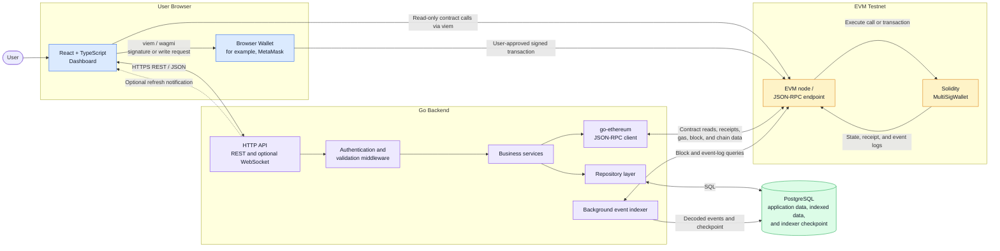
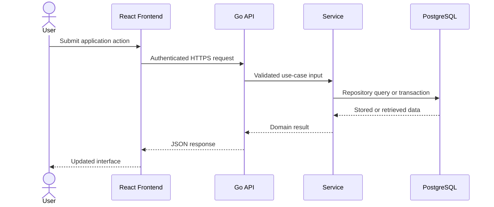
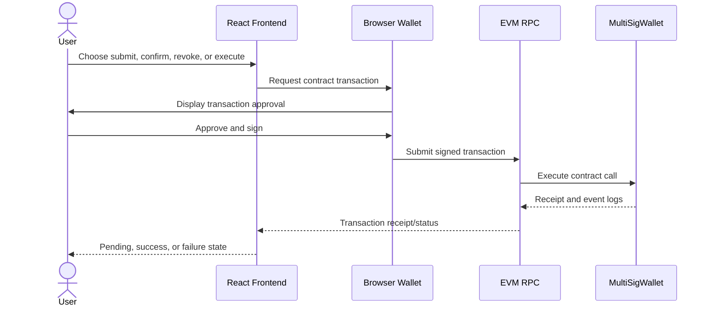
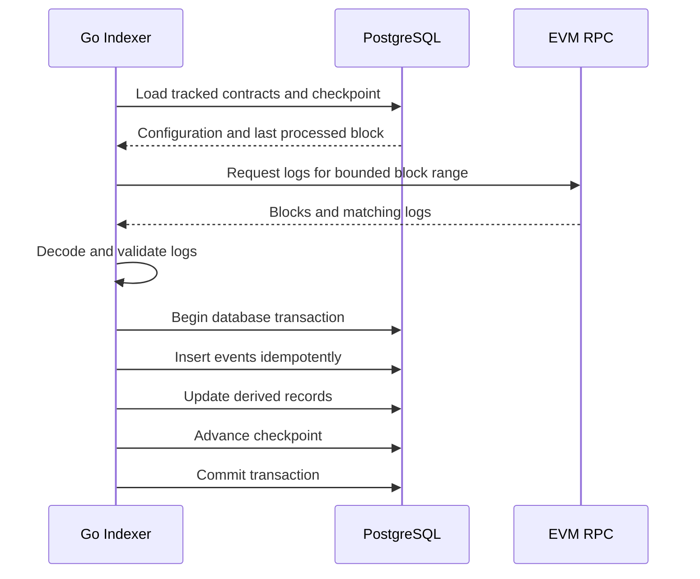

# System Architecture

## Status

This document describes the planned architecture of the Web3 Wallet Dashboard. At the current milestone the Go backend implements bearer-token authentication, wallet CRUD, supported-chain metadata, and tracked-contract CRUD, all owner-scoped on the three-layer architecture; the React frontend, background indexer, and on-chain integration remain planned.

## Architectural objective

The system combines off-chain application data with on-chain multisig activity while preserving a clear trust boundary: application records are managed by the Go API, and state-changing blockchain transactions are approved and signed by the user's browser wallet.

The architecture supports three primary data paths:

1. **Off-chain application path:** React → Go REST API → PostgreSQL.
2. **On-chain interaction path:** React → browser wallet or viem public client → EVM JSON-RPC → `MultiSigWallet`.
3. **Indexing path:** Go indexer → EVM JSON-RPC → PostgreSQL → Go REST API → React.

## System context


```mermaid
flowchart LR
    USER([User])
    APP[Web3 Wallet Dashboard]
    WALLET[Browser Wallet]
    RPC[EVM JSON-RPC Provider]
    CONTRACT[MultiSigWallet on EVM Testnet]

    USER -->|Uses| APP
    APP -->|Requests signatures and writes| WALLET
    APP <-->|Reads chain data| RPC
    WALLET -->|Submits user-signed transactions| RPC
    RPC <-->|Calls, receipts, and logs| CONTRACT
```

## Container architecture


```mermaid
flowchart LR
    USER([User])

    subgraph BROWSER["User Browser"]
        FE["React + TypeScript<br/>Dashboard"]
        WALLET["Browser Wallet<br/>for example, MetaMask"]
        FE -->|"viem / wagmi<br/>signature or write request"| WALLET
    end

    subgraph BACKEND["Go Backend"]
        API["HTTP API<br/>REST and optional WebSocket"]
        AUTH["Authentication and<br/>validation middleware"]
        SERVICE["Business services"]
        REPO["Repository layer"]
        CHAIN["go-ethereum<br/>JSON-RPC client"]
        INDEXER["Background event indexer"]

        API --> AUTH
        AUTH --> SERVICE
        SERVICE --> REPO
        SERVICE --> CHAIN
    end

    DB[("PostgreSQL<br/>application data, indexed data,<br/>and indexer checkpoint")]

    subgraph EVM["EVM Testnet"]
        RPC["EVM node /<br/>JSON-RPC endpoint"]
        CONTRACT["Solidity<br/>MultiSigWallet"]

        RPC -->|"Execute call or transaction"| CONTRACT
        CONTRACT -->|"State, receipt, and event logs"| RPC
    end

    USER --> FE

    FE <-->|"HTTPS REST / JSON"| API
    API -.->|"Optional refresh notification"| FE

    REPO <-->|"SQL"| DB

    FE -->|"Read-only contract calls via viem"| RPC
    WALLET -->|"User-approved signed transaction"| RPC
    CHAIN <-->|"Contract reads, receipts,<br/>gas, block, and chain data"| RPC
    INDEXER <-->|"Block and event-log queries"| RPC
    INDEXER -->|"Decoded events and checkpoint"| DB

    classDef browser fill:#dbeafe,stroke:#2563eb,color:#111827;
    classDef backend fill:#ede9fe,stroke:#7c3aed,color:#111827;
    classDef database fill:#dcfce7,stroke:#16a34a,color:#111827;
    classDef chain fill:#fef3c7,stroke:#d97706,color:#111827;

    class FE,WALLET browser;
    class API,AUTH,SERVICE,REPO,CHAIN,INDEXER backend;
    class DB database;
    class RPC,CONTRACT chain;
```

## Component responsibilities

### React and TypeScript dashboard

Responsibilities:

- Render authentication, wallet, contract, transaction, and event screens.
- Call the Go REST API through a typed client.
- Manage loading, empty, error, pending, success, and failure states.
- Connect to the browser wallet through viem and wagmi.
- Detect the connected account and chain.
- Perform selected public contract reads.
- Request user approval for state-changing contract calls.
- Refresh indexed dashboard data after on-chain activity.

The frontend must not present a submitted wallet request as successful until the resulting EVM transaction receipt confirms success.

### Browser wallet

Responsibilities:

- Hold the user's private keys outside the application.
- Display transaction details for user approval.
- Sign approved transactions locally.
- Submit signed transactions to the configured EVM network.

The Go backend must not receive seed phrases or private keys.

### Go HTTP API

Responsibilities:

- Route HTTP requests.
- Authenticate protected requests.
- Validate and deserialize input.
- Invoke business services.
- Serialize consistent success and error responses.
- Expose pagination and filtering for collection endpoints.
- Expose liveness and readiness checks.
- Optionally emit refresh notifications after the REST and indexer flows are stable.

Handlers should remain thin and must not contain persistence or EVM-specific business logic.

### Authentication and validation middleware

Responsibilities:

- Establish authenticated application-user identity.
- Reject missing or invalid authentication.
- Attach request-scoped identity and metadata to the Go context.
- Enforce request-level concerns before handlers invoke services.

Record ownership authorization remains a service or repository-query responsibility and must not rely only on route middleware.

### Business services

Responsibilities:

- Implement application use cases.
- Enforce ownership and domain rules.
- Coordinate repositories and the chain client.
- Translate persistence and RPC failures into application-level errors.
- Define transaction boundaries where multiple writes must succeed together.

Services must not depend on HTTP-specific request or response types.

### Repository layer

Responsibilities:

- Execute PostgreSQL queries.
- Map database records into domain or persistence models.
- Apply user-ownership conditions to protected queries.
- Support transactions needed for atomic updates.
- Surface duplicate, missing-record, and database failures in a form services can interpret.

Repositories must not implement HTTP response behavior.

### go-ethereum chain client

Responsibilities:

- Connect to a configured EVM JSON-RPC endpoint.
- Verify the expected chain ID.
- Load and use the `MultiSigWallet` ABI.
- Read owners, thresholds, transaction counts, and transaction state.
- Retrieve blocks, logs, receipts, and gas information required by backend use cases.
- Decode RPC errors into chain-boundary errors.

The initial backend surface includes a typed, read-only `MultiSigReader` for owners, threshold, transaction count, ownership checks, transactions, and confirmations. It uses go-ethereum's ABI codec inside `backend/internal/evm`, while the chain-reader boundary carries plain Go values. Transaction and confirmation reads capture one block and use it for every related call.

The chain client does not hold user private keys and is not responsible for signing browser-user transactions.

### Background event indexer

Responsibilities:

- Discover tracked contracts and their indexing start points.
- Load the stored checkpoint.
- Query bounded block ranges.
- Filter and decode supported contract events.
- Persist events idempotently.
- Derive normalized multisig transaction and confirmation data where appropriate.
- Advance checkpoint state only after event persistence succeeds.
- Retry transient RPC failures with bounded backoff.
- Stop cleanly when the application is shutting down.

The initial indexer is a Go background component. It may later run as a separate process using the same internal packages, but a message queue is not required for the initial version.

### PostgreSQL

Planned responsibilities:

- Application users and authentication data
- Saved wallet addresses
- Tracked contracts and chain metadata
- Multisig transactions and confirmations
- Decoded contract events
- Indexer checkpoint state
- Idempotency identifiers

PostgreSQL is the source of truth for off-chain application records and indexed dashboard views. The EVM chain remains the source of truth for contract state.

### EVM JSON-RPC endpoint

Responsibilities:

- Accept public contract calls and user-signed transactions.
- Return block, receipt, gas, chain, and log data.
- Expose the EVM testnet where the `MultiSigWallet` is deployed.

The application must handle RPC timeouts, provider rate limits, transient failures, and chain mismatches.

### Solidity MultiSigWallet

Responsibilities are defined by the existing contract and ABI. The intended application flow depends on support for:

- Owner and threshold reads
- Transaction submission
- Confirmation
- Confirmation revocation
- Execution
- Events sufficient to reconstruct or display relevant activity

Contract capabilities and event signatures must be verified against the existing source before the API, frontend, and indexer schemas are finalized.

## Data flows

### 1. Off-chain application flow


```mermaid
sequenceDiagram
    actor User
    participant FE as React Frontend
    participant API as Go API
    participant SVC as Service
    participant DB as PostgreSQL

    User->>FE: Submit application action
    FE->>API: Authenticated HTTPS request
    API->>SVC: Validated use-case input
    SVC->>DB: Repository query or transaction
    DB-->>SVC: Stored or retrieved data
    SVC-->>API: Domain result
    API-->>FE: JSON response
    FE-->>User: Updated interface
```

This flow manages application users, saved wallets, tracked contracts, and queries over indexed data.

### 2. On-chain write flow


```mermaid
sequenceDiagram
    actor User
    participant FE as React Frontend
    participant W as Browser Wallet
    participant RPC as EVM RPC
    participant C as MultiSigWallet

    User->>FE: Choose submit, confirm, revoke, or execute
    FE->>W: Request contract transaction
    W->>User: Display transaction approval
    User->>W: Approve and sign
    W->>RPC: Submit signed transaction
    RPC->>C: Execute contract call
    C-->>RPC: Receipt and event logs
    RPC-->>FE: Transaction receipt/status
    FE-->>User: Pending, success, or failure state
```

The browser wallet owns the signing boundary. The Go API may track or read the transaction but does not sign it.

### 3. Contract-read flow

Public state may be read through either path:

- React → viem → EVM JSON-RPC for direct user-interface reads.
- Go service → go-ethereum client → EVM JSON-RPC for backend normalization, validation, receipts, and indexed workflows.

The application must identify whether displayed data is a direct chain read or an eventually consistent indexed database view.

### 4. Event-indexing flow


```mermaid
sequenceDiagram
    participant IDX as Go Indexer
    participant DB as PostgreSQL
    participant RPC as EVM RPC

    IDX->>DB: Load tracked contracts and checkpoint
    DB-->>IDX: Configuration and last processed block
    IDX->>RPC: Request logs for bounded block range
    RPC-->>IDX: Blocks and matching logs
    IDX->>IDX: Decode and validate logs
    IDX->>DB: Begin database transaction
    IDX->>DB: Insert events idempotently
    IDX->>DB: Update derived records
    IDX->>DB: Advance checkpoint
    IDX->>DB: Commit transaction
```

If persistence fails, the checkpoint must not advance. Reprocessing the range must not create duplicates.

### 5. Indexed-dashboard flow

1. React requests indexed transactions or events from the Go API.
2. The API applies authentication, ownership, filtering, and pagination.
3. The repository queries PostgreSQL.
4. The API returns typed JSON data.
5. React renders the current indexed view.
6. React initially polls or refreshes after a transaction receipt. Optional WebSocket notification may later signal that fresh indexed data is available.

## Initial persistence model

The detailed design belongs in `database-schema.md`, but the initial architecture expects these entities:

- `users`
- `wallets`
- `tracked_contracts`
- `multisig_transactions`
- `transaction_confirmations`
- `contract_events`
- `indexed_blocks` or an equivalent checkpoint table

Likely event uniqueness inputs:

- Chain ID
- Transaction hash
- Log index

The final unique constraints must be chosen before indexer implementation.

## Trust boundaries

### Browser trust boundary

- Private keys remain in the browser wallet.
- The frontend must treat connected account and chain as changeable state.
- The UI must display contract address, network, action, and transaction status clearly.

### API trust boundary

- Every external request is untrusted.
- Authentication does not replace per-record authorization.
- User-controlled addresses, filters, identifiers, and pagination inputs require validation.
- Errors must not expose secrets or internal database details.

### Database trust boundary

- Database constraints reinforce application invariants.
- Sensitive authentication data must be stored using an appropriate one-way password hash or secure session representation.
- Credentials and connection strings remain outside source control.

### RPC trust boundary

- RPC responses may be delayed, unavailable, rate-limited, or associated with the wrong chain.
- The backend and frontend must verify chain ID.
- Indexed data is eventually consistent and may require basic reorganization handling.

### Contract trust boundary

- The existing contract source, ABI, events, access controls, and Foundry tests must be reviewed before integration.
- Frontend authorization hints are not security controls; the Solidity contract enforces on-chain authorization.

## Failure handling

### HTTP API

- Validate input before service invocation.
- Use consistent application error codes and HTTP statuses.
- Add request timeouts and propagate context cancellation.
- Recover from unexpected handler panics without exposing internals.

### PostgreSQL

- Use transactions for atomic multi-record changes.
- Map uniqueness and foreign-key failures consistently.
- Add integration tests against a real PostgreSQL instance.

### EVM RPC

- Apply explicit timeouts.
- Retry only transient failures and use bounded backoff.
- Do not blindly retry state-changing user operations.
- Map common RPC and receipt failures into user-readable states.

### Indexer

- Process bounded ranges to avoid oversized RPC requests.
- Persist events and checkpoint changes atomically.
- Make insertion idempotent.
- Log chain, contract, block range, and error context.
- Resume from the last successful checkpoint after restart.

## Deployment shape

The initial deployment is intentionally simple:

```text
Static React frontend
        |
        v
Single Go application deployment
  |-- REST API
  |-- background indexer
  |-- go-ethereum client
        |
        +--> Managed PostgreSQL
        +--> EVM JSON-RPC provider

MultiSigWallet deployed and verified on an EVM testnet
```

A separate indexer process may be considered if operational requirements justify it. It is not required for the initial portfolio version.

Locally and on a single host the shape is three Compose services built from one image:

- `postgres`, the `postgres:16-alpine` service that already backs local development.
- `migrate`, a one-shot service from the backend image with the command overridden to `migrate up`. It waits for PostgreSQL to report healthy and exits once the schema is current.
- `api`, the same image with the default command, publishing port 8080. It waits for `migrate` to exit successfully, so the API never serves against a schema that has not been brought up to date.

The image is a two-stage build at the repository root. `golang:1.26-alpine` compiles `./cmd/api` and `./cmd/migrate` with `CGO_ENABLED=0`, and `alpine:3.20` carries the two binaries as a non-root user, the same Alpine family as the PostgreSQL service. The default command is the API and the migration service overrides only that command, so both entry points ship in one image rather than two Dockerfiles.

The image's `HEALTHCHECK` calls `GET /health/live` and nothing else. Liveness answers whether the process is running, and a database blip must not restart a container that is still serving traffic. That is the reason B3 split the two endpoints, and it is why readiness stays out of the container health contract and remains an endpoint for callers and orchestrators.

## Timestamps

Every timestamp in the system is UTC. PostgreSQL stores `TIMESTAMPTZ`, the API serializes RFC 3339 with a `Z` suffix, and the container image sets `TZ=UTC`, so the process time zone and the log timestamps read UTC rather than the host's. No layer converts to a local time zone for storage, transport, or logs.

## Architectural decisions and scope guards

- Keep one monorepo for frontend, backend, contracts, documentation, and CI.
- Use standard-library HTTP concepts before adding a framework.
- Use REST before optional WebSocket notifications.
- Use one Go indexer; do not create duplicate indexing components.
- Do not add RabbitMQ, Kafka, Redis, or microservices without evidence that the simpler design is insufficient.
- Use viem and wagmi in the frontend and go-ethereum in the backend.
- Use PostgreSQL as the initial persistent store.
- Use a browser wallet for all user transaction signing.
- Target a testnet before any mainnet consideration.

These decisions may later receive individual Architecture Decision Records in `docs/adr/`.

## Known limitations

- Readiness covers PostgreSQL connectivity only; EVM RPC availability and domain-state checks are intentionally excluded.
- The Week-6 indexer tables (multisig_transactions, transaction_confirmations, contract_events, indexer_checkpoints) remain proposed; the user, wallet, chain, and contract tables are implemented in migrations 0001 through 0006.
- The RPC target is Sepolia and the provider is Alchemy. Provider availability and rate limits remain external dependencies; retry and reorganization policies are not implemented by this client.
- Contract event coverage must be checked against the existing ABI.
- Deep chain-reorganization handling is outside the initial scope.
- Indexed dashboard data may lag direct chain state.
- Optional WebSocket behavior is not defined and is not required for the first working version.

## Health and readiness

`GET /health/live` reports process liveness and returns `200 {"status":"ok"}` without querying dependencies. The existing `GET /health` route is a compatibility alias. Both are public and pass through request access logging. The method-qualified Go `GET` patterns also accept `HEAD`; unsupported methods return `405` with `Allow`.

`GET /health/ready` checks the PostgreSQL pool on every request with a fixed two-second timeout derived from the request context. It does not cache results or inspect domain state and does not check EVM RPC. A successful ping returns `200 {"status":"ok"}`. A database error, timeout, or request cancellation returns `503` with the standard `SERVICE_UNAVAILABLE` envelope and neutral `not ready` message. The underlying cause is logged at error level with the request ID and is not returned to the caller.

## Rate limiting

Two tiers are constructed in `cmd/api`: a global tier at 60 requests per minute with a burst of 10, and an authentication tier at 5 requests per minute with a burst of 2. Both are hand-rolled stdlib token buckets, one bucket per key, refilled from elapsed wall-clock time on each request and protected by one mutex. `httpapi` declares the `RateLimiter` interface and owns the middleware; `cmd/api` owns the implementation, the same split as `databaseReadiness`.

The global tier is one chain-wide wrap: `requestID -> access log -> rate limit -> panic recovery -> mux`. The position is load-bearing. A request with a missing or invalid bearer token is counted before `RequireAuth` reaches the session lookup, and an unmatched path is counted as well. Both tiers key on the client address with the source port removed, one namespace for every route, because the address is known before routing while an authenticated identity is not. The three health paths skip the wrap inline, above route matching. The authentication tier wraps `login` and `register` alone, inside the global one, so those two routes carry a stricter budget on top of the shared one.

Denials write `429` with code `RATE_LIMITED`, the neutral message `too many requests`, and `Retry-After` in whole seconds rounded up. No `X-RateLimit-*` headers are sent.

Cleanup has two parts. A sweep runs at most once a minute, under the same mutex, from whichever request is first after the interval elapses, and deletes every bucket untouched past the idle threshold. That is what bounds memory, since a one-off caller is never visited again and nothing else would remove its bucket. Between sweeps, a bucket that crosses the threshold is replaced full on its next request. The threshold is never shorter than one full refill, so a dropped bucket can never hold more than an honest refill would. State is per process: limits do not aggregate across replicas and reset on restart.

## Caching

No cache is built on the wallets list. This section records the measurement that decided it, the finding it surfaced, and what would reopen the question.

Method: one user with 2,000 wallets across three chain IDs, PostgreSQL 16.15, `go test -bench` calling `wallet.PostgresWalletRepo.List` directly with no HTTP layer, 50 timed iterations per scenario after 5 untimed warmup iterations, nearest-rank p50 and p95. All values are milliseconds.

| Scenario | List p50 | List p95 | COUNT(*) p50 | COUNT(*) p95 | SELECT p50 | SELECT p95 |
| --- | --- | --- | --- | --- | --- | --- |
| Unfiltered pagination | 0.748 | 1.496 | 0.468 | 0.962 | 0.242 | 0.460 |
| Chain ID filter | 0.917 | 3.656 | 0.368 | 0.925 | 0.530 | 1.105 |
| Search filter | 2.821 | 3.932 | 2.417 | 3.374 | 0.387 | 0.706 |

No cache is built: the unfiltered p95 of 1.496 ms is well under the 5 ms bar that would have justified one, and the filtered scenarios clear it too.

The measurement surfaced a separate finding in the `COUNT(*)` query, which runs before the page select on every call. In the search scenario it accounts for 2.417 ms of the 2.821 ms p50, about 86 percent of the call. The share is smaller under the chain ID filter, where the page select is the more expensive half, but the count is the half that scales with the owner's whole wallet set rather than with the page. That is a query shape problem rather than a caching problem, and a cache would have hidden it rather than fixed it. If it is ever worth doing, the real fix is to merge the count into the page query with a window function, so the endpoint makes one round trip instead of two. That is a backlog idea, not a requirement of this block.

Revisit trigger: re-run this benchmark when typical per-user wallet counts regularly exceed roughly 10,000, about five times what was measured here, or if production ever shows this endpoint's p95 above 5 ms. Either one is a reason to measure again, not a reason to assume a cache is now needed.

## Open decisions

1. (Resolved for B3) Bearer-token authentication, not session cookies. See docs/auth.md.
2. (Resolved) The target EVM testnet is Sepolia, chain ID `11155111`, and the RPC provider is Alchemy.
3. Exact contract events and any required contract updates.
4. Indexer confirmation depth and basic reorganization policy.
5. Whether readiness should include EVM RPC connectivity.
6. Whether the API exposes normalized contract reads in addition to direct frontend reads.
7. Whether optional real-time updates use WebSocket or server-sent events.
8. Whether the indexer remains in the API process or uses a separate executable at deployment time.

## Runtime lifecycle

The API process has one defined lifecycle: bind, serve, drain, close, exit.

1. Start. `DATABASE_URL` is required and the process fails closed when it is empty. The pool is opened and pinged with a 5 second timeout, then the listener is bound. A bind failure exits with code 1 before serving.

2. Signals. `SIGTERM` and `SIGINT` cancel the process context. This is the only shutdown trigger.

3. Drain. `http.Server.Shutdown` stops accepting new connections and lets in flight requests finish inside a 10 second grace window. A second `SIGTERM` during the drain window is absorbed, and `SIGKILL` is the only escape hatch.

4. Forced close. If the grace window expires, `http.Server.Close` terminates the remaining connections, the event is logged, and the exit code is 1.

5. Close. The database pool remains available while the HTTP server drains so in-flight readiness checks can finish, then it is closed exactly once from the function that opened it. A close failure is logged; when the run is otherwise clean it escalates to exit code 1, and an earlier error is never masked. A clean drain with a successful close exits with code 0.

Later blocks insert themselves into this sequence instead of adding their own. The background worker stops between the drain and the pool close, described next. The container runtime sends `SIGTERM` and relies on this same order.

The HTTP server uses a 15 second `WriteTimeout`, which is a budget for the whole response. Streaming or WebSocket routes will need per-route timeout handling. B1 records this constraint and does not solve it.

## Background worker

Periodic work runs in `internal/worker`. A `Job` implements one method, `Run(ctx) error`, and a `Worker` owns the tick, the per-run timeout, the failure log, and the stop handshake. The package exists so a second periodic job does not mean writing ticker and shutdown logic again.

The worker is ticker-driven. Each tick gets its own context bounded by ten seconds, a separate constant from the two second readiness probe, because a run may touch many rows rather than one ping. A returned error is logged at error level and the next tick proceeds; one bad run never stops the worker or the process. A panicking job is recovered and logged for the same reason, since a panic in a goroutine would otherwise take the process down.

`Stop` cancels future ticks and waits for an in-flight run, bounded by the same ten second timeout, so a stuck database cannot hang the exit. When it has to give up it returns an error; `run.go` logs that error and escalates it to the process exit code only when no earlier error exists, the same rule the pool close follows. `run.go` starts the worker before `serve` is called and stops it after the HTTP drain, while the pool is still open.

The first job is the session purge. `ValidateSession` rejects an expired session but never deletes it, so with a seven day session TTL every login that does not explicitly log out would leave a row behind permanently. The job runs hourly, calls `user.Service.PurgeExpiredSessions`, hits `DELETE FROM user_sessions WHERE expires_at < NOW()` on server time, and logs the purged count at info level on every run including zero. Migration 0007 adds an index on `user_sessions.expires_at`, since the statement runs every hour for the life of the process.

State is per process. Two API instances would each run their own worker over the same table; the delete is idempotent, so the second one simply removes fewer rows. A job that needs coordination across replicas is not solved here.

## Request observability

The API constructs a JSON logger with `log/slog` and injects it through the server and router. `LOG_LEVEL` accepts `debug`, `info`, `warn`, or `error`; an empty value defaults to `info`, and an invalid value prevents startup.

Each request, including liveness and readiness probes, produces one access-log entry with method, path, matched route template, status, bytes written, duration in milliseconds, the direct peer address, and request ID. Authenticated requests also include the user ID. `X-Forwarded-For` is not trusted. 5xx responses log at error, 4xx responses at warn, and other statuses at info. A response write failure adds `write_error` to the same entry and raises its level to at least warn. A request-ID generation failure adds `request_id_generation_error` and raises its level to error. Duration retains microsecond precision as a fractional number of milliseconds. The mux's method-qualified pattern is recorded as its path template; an unmatched path has no route value and keeps the plain-text 404.

Request IDs use 1 to 64 ASCII letters, digits, dots, underscores, or hyphens. Missing and invalid values are replaced with a generated UUID v4 and returned in `X-Request-ID`.

Unexpected panics are logged with their value and stack trace in the access-log entry. Before a response starts, recovery writes the standard JSON envelope with HTTP 500, code `INTERNAL_SERVER_ERROR`, message `internal error`, and no details. After response commitment, recovery leaves the existing status and body untouched. An incoming `http.ErrAbortHandler` is re-panicked unchanged. The catch-all and method-not-allowed behavior remains a B7 candidate.

## Blockchain client

Chain reads live in `internal/evm`. The package wraps an Ethereum JSON-RPC endpoint and is the only place this module imports `github.com/ethereum/go-ethereum`. No go-ethereum type crosses the package boundary; any future HTTP exposure translates to DTOs at the edge, the same discipline every other domain follows.

`Client` is constructed with `New(ctx, rpcURL, expectedChainID)`. The constructor dials the endpoint and immediately compares the chain ID it serves against the expected value. A mismatch is a returned error, never a panic or a log line, because a client pointed at the wrong network must not appear to work. The expected chain ID is a parameter rather than a constant so the package stays chain-agnostic; the Sepolia call site passes `11155111`, the same value the `chains` table is seeded with in migration 0004.

The package consumes a two-method `ChainReader` interface, `ChainID` and `BlockNumber`, defined on the consumer side like `ReadinessChecker` and `RateLimiter`. The live `ethclient` sits behind a small in-package adapter that converts its `*big.Int` chain ID to `uint64`; unit tests substitute a fake, and one integration test, gated on `EVM_RPC_URL`, dials Sepolia through Alchemy.

Configuration: `EVM_RPC_URL` holds the Sepolia endpoint on Alchemy and is read, fail-closed on empty, at the entrypoint that constructs the client. The package itself never reads the environment. Every read takes the caller's `context.Context`; no package-level default timeout exists. Call `Client.Close()` when finished to release the transport opened by `New`; the method exposes no go-ethereum type. Nothing consumes this package over HTTP yet, and the frontend freeze is unaffected.
