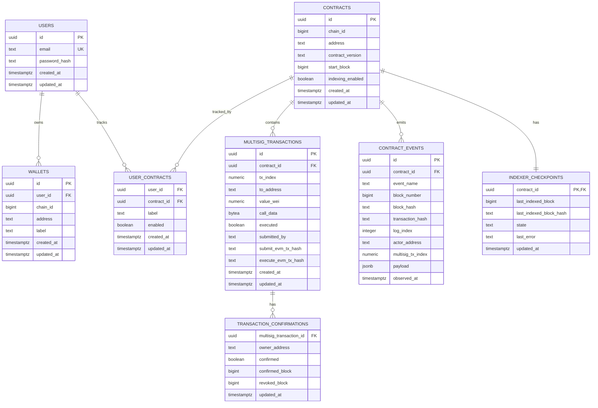

# Initial PostgreSQL Schema

## Status

This document is an initial logical schema. No PostgreSQL migrations are implemented at the time of writing. Names, types, and constraints must be confirmed during backend implementation.

## Design goals

- Separate application users from blockchain identities.
- Treat a saved wallet as an off-chain address record, not proof of key ownership.
- Represent each deployed multisig contract once per chain and address.
- Allow multiple users to track the same deployed contract without indexing it multiple times.
- Store raw event identity and normalized dashboard projections.
- Make event processing idempotent.
- Persist indexer checkpoint state safely.
- Support user ownership, pagination, filtering, and restartable indexing.

## Conventions

- Use UTC timestamps.
- Use migration-managed defaults rather than application-generated timestamps where appropriate.
- Store EVM addresses in one canonical representation for equality checks, initially lowercase `0x`-prefixed hexadecimal text.
- Validate address length and hexadecimal shape in the application and optionally with database checks.
- Store wei values as `NUMERIC(78,0)` to represent `uint256` safely.
- Store block numbers and log indexes using types chosen to preserve required unsigned ranges; common testnet values fit PostgreSQL `BIGINT`, but conversion boundaries must be validated.
- Never use floating-point types for wei values.
- Do not store private keys, seed phrases, or raw wallet credentials.

## Relationship overview

## Tables

### `users`

Purpose: application identity and authentication record.

Proposed columns:

| Column | Type | Constraints and notes |
|---|---|---|
| `id` | `UUID` | Primary key |
| `email` | `TEXT` or `CITEXT` | Unique, normalized |
| `password_hash` | `TEXT` | Approved password hash only; never plaintext |
| `created_at` | `TIMESTAMPTZ` | Not null, default current timestamp |
| `updated_at` | `TIMESTAMPTZ` | Not null |

Authentication-specific session or refresh-token tables must be designed after selecting the authentication mechanism.

Indexes:

- Unique normalized email index

Security:

- Password hashes must not appear in ordinary API DTOs or logs.
- Account lookup behavior must not leak sensitive authentication details.

### `wallets`

Purpose: user-owned saved EVM address metadata.

Proposed columns:

| Column | Type | Constraints and notes |
|---|---|---|
| `id` | `UUID` | Primary key |
| `user_id` | `UUID` | Foreign key to `users`, not null |
| `chain_id` | `BIGINT` | Positive, not null |
| `address` | `VARCHAR(42)` | Canonical EVM address, not null |
| `label` | `VARCHAR(100)` | User-visible label, not null or documented nullable |
| `created_at` | `TIMESTAMPTZ` | Not null |
| `updated_at` | `TIMESTAMPTZ` | Not null |

Constraints:

- Unique `(user_id, chain_id, address)`
- Address validation in application code and optional database check

Indexes:

- `(user_id, created_at DESC)`
- `(user_id, chain_id)`

Important meaning:

- This table records that an application user saved an address.
- It does not prove that the user controls the address's private key.

### `contracts`

Purpose: one global record for each supported `MultiSigWallet` deployment.

Proposed columns:

| Column | Type | Constraints and notes |
|---|---|---|
| `id` | `UUID` | Primary key |
| `chain_id` | `BIGINT` | Positive, not null |
| `address` | `VARCHAR(42)` | Canonical contract address, not null |
| `contract_version` | `VARCHAR(50)` | For example `multisig-v1.1` |
| `start_block` | `BIGINT` | Deployment or configured indexing start block |
| `indexing_enabled` | `BOOLEAN` | Global indexer control |
| `created_at` | `TIMESTAMPTZ` | Not null |
| `updated_at` | `TIMESTAMPTZ` | Not null |

Constraints:

- Unique `(chain_id, address)`
- `start_block >= 0`

Indexes:

- `(chain_id, indexing_enabled)`

Reason for global normalization:

Multiple users may track the same contract. The system should index one deployment once rather than start one duplicate indexer stream per user.

### `user_contracts`

Purpose: user-specific relationship to a globally identified tracked contract.

Proposed columns:

| Column | Type | Constraints and notes |
|---|---|---|
| `user_id` | `UUID` | Foreign key to `users` |
| `contract_id` | `UUID` | Foreign key to `contracts` |
| `label` | `VARCHAR(100)` | User-specific label |
| `enabled` | `BOOLEAN` | Whether shown for that user |
| `created_at` | `TIMESTAMPTZ` | Not null |
| `updated_at` | `TIMESTAMPTZ` | Not null |

Primary or unique key:

- `(user_id, contract_id)`

Indexes:

- `(user_id, enabled, created_at DESC)`

Deletion behavior:

Removing one user's relationship must not delete shared contract events or another user's tracking relationship. Global contract cleanup requires a separate explicit policy.

### `multisig_transactions`

Purpose: current indexed projection of each transaction stored in a `MultiSigWallet`.

Proposed columns:

| Column | Type | Constraints and notes |
|---|---|---|
| `id` | `UUID` | Primary key |
| `contract_id` | `UUID` | Foreign key to `contracts` |
| `tx_index` | `NUMERIC(78,0)` | Contract transaction index |
| `to_address` | `VARCHAR(42)` | Target address |
| `value_wei` | `NUMERIC(78,0)` | ETH value in wei |
| `call_data` | `BYTEA` | Arbitrary call data |
| `executed` | `BOOLEAN` | Current derived state |
| `submitted_by` | `VARCHAR(42)` | Owner from submit event |
| `submit_evm_tx_hash` | `VARCHAR(66)` | Outer EVM transaction hash |
| `submit_block_number` | `BIGINT` | Submission block |
| `execute_evm_tx_hash` | `VARCHAR(66)` | Nullable until executed |
| `execute_block_number` | `BIGINT` | Nullable until executed |
| `created_at` | `TIMESTAMPTZ` | Projection creation time |
| `updated_at` | `TIMESTAMPTZ` | Last projection update |

Constraints:

- Unique `(contract_id, tx_index)`
- `value_wei >= 0`
- `tx_index >= 0`

Indexes:

- `(contract_id, tx_index DESC)`
- `(contract_id, executed, tx_index DESC)`
- `(contract_id, submitted_by)` where filtering measurements justify it

The event table remains the append-oriented history. This table is the current query-friendly projection.

### `transaction_confirmations`

Purpose: current confirmation state for one owner and one multisig transaction.

Proposed columns:

| Column | Type | Constraints and notes |
|---|---|---|
| `multisig_transaction_id` | `UUID` | Foreign key to `multisig_transactions` |
| `owner_address` | `VARCHAR(42)` | Confirming owner |
| `confirmed` | `BOOLEAN` | Current projected state |
| `confirmed_evm_tx_hash` | `VARCHAR(66)` | Latest confirmation hash, nullable |
| `confirmed_block_number` | `BIGINT` | Latest confirmation block, nullable |
| `revoked_evm_tx_hash` | `VARCHAR(66)` | Latest revocation hash, nullable |
| `revoked_block_number` | `BIGINT` | Latest revocation block, nullable |
| `updated_at` | `TIMESTAMPTZ` | Last state transition time |

Primary or unique key:

- `(multisig_transaction_id, owner_address)`

Indexes:

- `(multisig_transaction_id, confirmed)`

Repeated confirm/revoke history remains available in `contract_events`; this table stores only the current projection.

### `contract_events`

Purpose: decoded event history with enough raw chain identity to support idempotency and investigation.

Proposed columns:

| Column | Type | Constraints and notes |
|---|---|---|
| `id` | `UUID` or `BIGSERIAL` | Primary key |
| `contract_id` | `UUID` | Foreign key to `contracts` |
| `event_name` | `VARCHAR(100)` | Supported ABI event name |
| `block_number` | `BIGINT` | Not null |
| `block_hash` | `VARCHAR(66)` | Not null |
| `transaction_hash` | `VARCHAR(66)` | Not null |
| `transaction_index` | `INTEGER` | Position in block where available |
| `log_index` | `INTEGER` | Not null |
| `actor_address` | `VARCHAR(42)` | Event owner/sender where applicable |
| `multisig_tx_index` | `NUMERIC(78,0)` | Nullable for non-transaction events |
| `payload` | `JSONB` | Decoded event fields not promoted to columns |
| `removed` | `BOOLEAN` | Default false; reserved for basic reorg handling |
| `observed_at` | `TIMESTAMPTZ` | Indexer observation time |

Idempotency constraint:

- Unique `(contract_id, transaction_hash, log_index)`

Indexes:

- `(contract_id, block_number DESC, log_index DESC)`
- `(contract_id, event_name, block_number DESC)`
- `(contract_id, multisig_tx_index)`
- `(contract_id, actor_address)` only if filtering requires it

Supported initial event names from the current contract:

- `SubmitTransaction`
- `ConfirmTransaction`
- `RevokeConfirmation`
- `ExecuteTransaction`
- `Deposit`, if added in the integration revision

Do not rely on `payload` alone for frequently filtered fields; promote measured query fields to typed columns.

### `indexer_checkpoints`

Purpose: record restart and progress state for each contract deployment.

Proposed columns:

| Column | Type | Constraints and notes |
|---|---|---|
| `contract_id` | `UUID` | Primary key and foreign key to `contracts` |
| `next_block` | `BIGINT` | Next block the indexer intends to process |
| `last_indexed_block` | `BIGINT` | Nullable before first successful range |
| `last_indexed_block_hash` | `VARCHAR(66)` | Nullable before first successful range |
| `state` | `VARCHAR(30)` | Proposed: `idle`, `running`, `error`, `disabled` |
| `last_error` | `TEXT` | Sanitized diagnostic, nullable |
| `retry_count` | `INTEGER` | Operational state, bounded |
| `updated_at` | `TIMESTAMPTZ` | Not null |

Constraints:

- Block values non-negative
- State restricted to documented values

A per-contract checkpoint makes it possible to add a newly tracked deployment with an earlier start block without rewinding unrelated contracts.

## Indexing transaction boundary

For each successfully processed block range, the indexer should use a database transaction that:

1. Inserts decoded `contract_events` using the idempotency constraint.
2. Updates `multisig_transactions` projections.
3. Updates `transaction_confirmations` projections.
4. Advances `indexer_checkpoints`.
5. Commits all changes together.

If any step fails, the transaction rolls back and the checkpoint does not advance. Reprocessing the range must be safe.

## Deletion and retention

Initial policy:

- Deleting a user may cascade to their `wallets` and `user_contracts` after authentication requirements are defined.
- Deleting a `user_contracts` record must not delete shared chain data.
- Contracts and indexed events should not be hard-deleted through ordinary user routes.
- Operational retention for sessions and logs will be defined with authentication and deployment designs.

## Address normalization

Initial proposal:

- Validate input using an EVM-aware library.
- Convert addresses to a canonical lowercase `0x` representation for equality and unique constraints.
- Optionally return checksum formatting at presentation boundaries.
- Never compare user-entered addresses as arbitrary case-sensitive text.

This decision must be applied consistently across Go, PostgreSQL, TypeScript, and indexer code.

## Chain reorganization preparation

The initial system is not expected to support deep reorganizations, but the schema retains:

- Block number
- Block hash
- Transaction hash
- Log index
- A `removed` marker
- Checkpoint block hash

Before testnet deployment, the indexer must define confirmation depth and how it responds when the stored checkpoint hash no longer matches the canonical chain.

## Migration order

Initial migration dependency order:

1. Required PostgreSQL extensions, if any
2. `users`
3. `wallets`
4. `contracts`
5. `user_contracts`
6. `multisig_transactions`
7. `transaction_confirmations`
8. `contract_events`
9. `indexer_checkpoints`
10. Indexes and constraints not created alongside tables

Each migration must have a documented rollback strategy appropriate to the migration tool.

## Open schema decisions

1. UUID generation method and extension.
2. `TEXT` plus normalized unique index versus `CITEXT` for email.
3. Session or token persistence after authentication design is chosen.
4. `BIGINT` versus `NUMERIC` for block and transaction indexes at Go/SQL boundaries.
5. Whether calldata is stored as `BYTEA` or normalized hexadecimal text.
6. Whether event primary keys use UUID or `BIGSERIAL`.
7. Final indexer checkpoint and confirmation-depth strategy.
8. Whether direct RPC state is cached and, if so, where cache metadata belongs.
9. Whether shared contracts remain indexed after no users track them.
