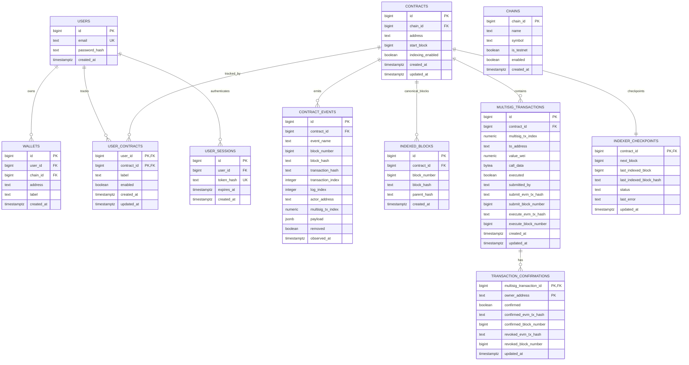

# PostgreSQL Schema

## Status

Migrations `0001` through `0008` are implemented. The application tables (users and sessions, wallets, chains, contracts and user_contracts) and the Week 6 indexer tables (indexed_blocks, contract_events, multisig_transactions, transaction_confirmations, indexer_checkpoints) exist as described below. The indexer persistence layer and its repository live in `backend/internal/indexer`; the scanner, log retrieval and API exposure are later Week 6 blocks. See `docs/adr/0001-wallet-id-and-schema-conventions.md` for MVP conventions and `docs/adr/0003-wallet-ownership-retrofit.md` for wallet ownership.

Earlier revisions of this document proposed UUID identifiers, a `contracts.contract_version` column and a transaction-hash event key. No migration implements them. Actual migrations override any remaining proposal text in this document.

## Design goals

- Separate application users from blockchain identities.
- Treat a saved wallet as an off-chain address record, not proof of key ownership.
- Represent each deployed multisig contract once per chain and address.
- Allow multiple users to track the same deployed contract without indexing it multiple times.
- Store raw event identity and normalized dashboard projections.
- Make event processing idempotent.
- Persist indexer checkpoint state safely.
- Support user ownership, pagination, filtering, and restartable indexing.

## Conventions

- IDs are `BIGINT`. Migrations `0001` to `0005` use `GENERATED ALWAYS AS IDENTITY`; `0003` used `BIGSERIAL`; both map to Go `int64`. There are no UUID columns.
- All timestamps are UTC and use `TIMESTAMPTZ`.
- EVM addresses are stored lowercase-canonical, `0x` plus 40 hex characters.
- Hashes are stored lowercase-canonical, `0x` plus 64 hex characters.
- Wei and other `uint256` values use `NUMERIC(78,0)`, never floating point. Wide values inside JSON payloads are decimal strings.
- Calldata is `BYTEA`; payloads are `JSONB`.
- Block numbers, transaction indexes and log indexes are non-negative `BIGINT` or `INTEGER`, validated before conversion at the Go boundary.
- The indexer tables carry shape `CHECK` constraints for addresses and hashes because a background process writes them, not only request handlers.
- Never store private keys, seed phrases, or raw wallet credentials.

## Relationship overview

```mermaid
erDiagram
    USERS ||--o{ WALLETS : owns
    USERS ||--o{ USER_CONTRACTS : tracks
    USERS ||--o{ USER_SESSIONS : authenticates
    CONTRACTS ||--o{ USER_CONTRACTS : tracked_by
    CONTRACTS ||--o{ CONTRACT_EVENTS : emits
    CONTRACTS ||--o{ INDEXED_BLOCKS : canonical_blocks
    CONTRACTS ||--o{ MULTISIG_TRANSACTIONS : contains
    CONTRACTS ||--|| INDEXER_CHECKPOINTS : checkpoints
    MULTISIG_TRANSACTIONS ||--o{ TRANSACTION_CONFIRMATIONS : has

    USERS {
        bigint id PK
        text email UK
        text password_hash
        timestamptz created_at
    }

    USER_SESSIONS {
        bigint id PK
        bigint user_id FK
        text token_hash UK
        timestamptz expires_at
        timestamptz created_at
    }

    WALLETS {
        bigint id PK
        bigint user_id FK
        bigint chain_id FK
        text address
        text label
        timestamptz created_at
    }

    CHAINS {
        bigint chain_id PK
        text name
        text symbol
        boolean is_testnet
        boolean enabled
        timestamptz created_at
    }

    CONTRACTS {
        bigint id PK
        bigint chain_id FK
        text address
        bigint start_block
        boolean indexing_enabled
        timestamptz created_at
        timestamptz updated_at
    }

    USER_CONTRACTS {
        bigint user_id PK,FK
        bigint contract_id PK,FK
        text label
        boolean enabled
        timestamptz created_at
        timestamptz updated_at
    }

    INDEXED_BLOCKS {
        bigint id PK
        bigint contract_id FK
        bigint block_number
        text block_hash
        text parent_hash
        timestamptz created_at
    }

    CONTRACT_EVENTS {
        bigint id PK
        bigint contract_id FK
        text event_name
        bigint block_number
        text block_hash
        text transaction_hash
        integer transaction_index
        integer log_index
        text actor_address
        numeric multisig_tx_index
        jsonb payload
        boolean removed
        timestamptz observed_at
    }

    MULTISIG_TRANSACTIONS {
        bigint id PK
        bigint contract_id FK
        numeric multisig_tx_index
        text to_address
        numeric value_wei
        bytea call_data
        boolean executed
        text submitted_by
        text submit_evm_tx_hash
        bigint submit_block_number
        text execute_evm_tx_hash
        bigint execute_block_number
        timestamptz created_at
        timestamptz updated_at
    }

    TRANSACTION_CONFIRMATIONS {
        bigint multisig_transaction_id PK,FK
        text owner_address PK
        boolean confirmed
        text confirmed_evm_tx_hash
        bigint confirmed_block_number
        text revoked_evm_tx_hash
        bigint revoked_block_number
        timestamptz updated_at
    }

    INDEXER_CHECKPOINTS {
        bigint contract_id PK,FK
        bigint next_block
        bigint last_indexed_block
        text last_indexed_block_hash
        text status
        text last_error
        timestamptz updated_at
    }
```

## Application tables

### `schema_migrations`

Purpose: records applied migrations so `cmd/migrate up` is idempotent.

| Column | Type | Constraints and notes |
| --- | --- | --- |
| `version` | `TEXT` | Primary key, the migration file prefix such as `0008_create_indexer_tables` |
| `applied_at` | `TIMESTAMPTZ` | Not null, default `NOW()` |

### `users`

| Column | Type | Constraints and notes |
| --- | --- | --- |
| `id` | `BIGINT` | Primary key, `BIGSERIAL` |
| `email` | `TEXT` | Not null, unique through `idx_users_email_lower` on `LOWER(email)` |
| `password_hash` | `TEXT` | Not null, bcrypt output only; never plaintext |
| `created_at` | `TIMESTAMPTZ` | Not null, default `NOW()` |

There is no `updated_at` column. Password hashes never appear in API DTOs or logs.

### `user_sessions`

| Column | Type | Constraints and notes |
| --- | --- | --- |
| `id` | `BIGINT` | Primary key, `BIGSERIAL` |
| `user_id` | `BIGINT` | Not null, foreign key to `users(id)` `ON DELETE CASCADE` |
| `token_hash` | `TEXT` | Not null, unique; only the SHA-256 hash of the opaque bearer token is stored |
| `expires_at` | `TIMESTAMPTZ` | Not null, fixed seven-day TTL set by the application |
| `created_at` | `TIMESTAMPTZ` | Not null, default `NOW()` |

Indexes: `idx_user_sessions_expires_at` on `(expires_at)`, used by the expired-session purge job.

### `chains`

| Column | Type | Constraints and notes |
| --- | --- | --- |
| `chain_id` | `BIGINT` | Primary key, the EVM chain id |
| `name` | `TEXT` | Not null |
| `symbol` | `TEXT` | Not null |
| `is_testnet` | `BOOLEAN` | Not null, default `FALSE` |
| `enabled` | `BOOLEAN` | Not null, default `TRUE` |
| `created_at` | `TIMESTAMPTZ` | Not null, default `NOW()` |

Seeded with `1` Ethereum, `137` Polygon and `11155111` Sepolia. Only Sepolia is reachable through the configured RPC endpoint.

### `wallets`

| Column | Type | Constraints and notes |
| --- | --- | --- |
| `id` | `BIGINT` | Primary key, identity |
| `address` | `TEXT` | Not null, lowercase-canonical address |
| `chain_id` | `BIGINT` | Not null, foreign key to `chains(chain_id)` |
| `label` | `TEXT` | Not null, user-visible label |
| `created_at` | `TIMESTAMPTZ` | Not null, default `NOW()` |
| `user_id` | `BIGINT` | Not null, foreign key to `users(id)` `ON DELETE CASCADE`, added by `0006` |

There is no `updated_at` column. A saved wallet records that a user saved an address; it does not prove control of the key.

Constraints and indexes:

- `uq_wallets_user_chain_address` unique `(user_id, chain_id, address)`.
- `idx_wallets_user_created_id` on `(user_id, created_at DESC, id DESC)` for the list query.

### `contracts`

One global row per supported `MultiSigWallet` deployment, shared by every user who tracks it.

| Column | Type | Constraints and notes |
| --- | --- | --- |
| `id` | `BIGINT` | Primary key, identity |
| `chain_id` | `BIGINT` | Not null, foreign key to `chains(chain_id)` `ON DELETE NO ACTION` |
| `address` | `TEXT` | Not null, lowercase-canonical contract address |
| `start_block` | `BIGINT` | Not null, `CHECK (start_block >= 0)`; the authoritative inclusive indexing start |
| `indexing_enabled` | `BOOLEAN` | Not null, default `TRUE`; the global indexer control |
| `created_at` | `TIMESTAMPTZ` | Not null, default `NOW()` |
| `updated_at` | `TIMESTAMPTZ` | Not null, default `NOW()` |

Constraints and indexes:

- `uq_contracts_chain_address` unique `(chain_id, address)`.
- `idx_contracts_chain_indexing_enabled` on `(chain_id, indexing_enabled)`, added by `0008` for the watch-set query.

`contract_version` does not exist and must not be added without a separate ABI/versioning design. `GetOrCreateDeployment` returns the existing row on conflict, so a stored `start_block` is never silently replaced by a later caller value.

### `user_contracts`

A user's relationship to a global deployment.

| Column | Type | Constraints and notes |
| --- | --- | --- |
| `user_id` | `BIGINT` | Foreign key to `users(id)` `ON DELETE CASCADE` |
| `contract_id` | `BIGINT` | Foreign key to `contracts(id)` `ON DELETE NO ACTION` |
| `label` | `TEXT` | Not null, user-specific label |
| `enabled` | `BOOLEAN` | Not null, default `TRUE`; display preference only |
| `created_at` | `TIMESTAMPTZ` | Not null, default `NOW()` |
| `updated_at` | `TIMESTAMPTZ` | Not null, default `NOW()`; bumped on an accepted `PATCH`, never exposed in API responses |

Primary key `(user_id, contract_id)`. Index `idx_user_contracts_user_enabled_created` on `(user_id, enabled, created_at DESC)`.

`enabled` never changes indexing. Removing a user's relationship must not delete shared contract or indexed data.

## Indexer tables (migration `0008`)

Indexed data is an eventually consistent PostgreSQL view of chain state. The EVM remains the source of truth for contract state.

### `indexed_blocks`

One canonical row per contract and block number, used for reorganization detection and ancestor lookup.

| Column | Type | Constraints and notes |
| --- | --- | --- |
| `id` | `BIGINT` | Primary key, identity |
| `contract_id` | `BIGINT` | Not null, foreign key to `contracts(id)` `ON DELETE NO ACTION` |
| `block_number` | `BIGINT` | Not null, `CHECK (>= 0)` |
| `block_hash` | `TEXT` | Not null, canonical lowercase hash |
| `parent_hash` | `TEXT` | Not null, canonical lowercase hash |
| `created_at` | `TIMESTAMPTZ` | Not null, default `NOW()` |

Unique `uq_indexed_blocks_contract_block_number` on `(contract_id, block_number)`. Only canonical blocks are stored: a rewind deletes rows above the common ancestor and rescans.

### `contract_events`

Decoded event history with enough raw chain identity to investigate and replay.

| Column | Type | Constraints and notes |
| --- | --- | --- |
| `id` | `BIGINT` | Primary key, identity |
| `contract_id` | `BIGINT` | Not null, foreign key to `contracts(id)` `ON DELETE NO ACTION` |
| `event_name` | `TEXT` | One of `SubmitTransaction`, `ConfirmTransaction`, `RevokeConfirmation`, `ExecuteTransaction` |
| `block_number` | `BIGINT` | Not null, `CHECK (>= 0)` |
| `block_hash` | `TEXT` | Not null, canonical lowercase hash |
| `transaction_hash` | `TEXT` | Not null, canonical lowercase hash |
| `transaction_index` | `INTEGER` | Not null, `CHECK (>= 0)` |
| `log_index` | `INTEGER` | Not null, `CHECK (>= 0)` |
| `actor_address` | `TEXT` | Nullable owner or sender, canonical lowercase address |
| `multisig_tx_index` | `NUMERIC(78,0)` | Nullable contract transaction index |
| `payload` | `JSONB` | Not null, default `{}`; normalized fields not promoted to columns |
| `removed` | `BOOLEAN` | Not null, default `FALSE`. A rewind sets it. It returns to `FALSE` only when the same occurrence is committed again while its block hash and log index are canonical |
| `observed_at` | `TIMESTAMPTZ` | Not null, default `NOW()` |

Idempotency constraint: unique `uq_contract_events_occurrence` on `(contract_id, block_hash, log_index)`.

The transaction hash is deliberately not part of that key. After a reorganization the same transaction can be re-included in a different block, which is a separate occurrence with its own block hash; keying on the transaction hash would either drop the second occurrence or collide with the first.

Indexes: `(contract_id, block_number, transaction_index, log_index)` for canonical replay order, `(contract_id, event_name, block_number DESC)`, and `(contract_id, multisig_tx_index)`.

The four supported events come from the deployed contract. `receive()` emits no event, so there is no deposit event to index. Adding an event requires a migration because the name is constrained.

### `multisig_transactions`

The current projection of each multisig transaction. The event table remains the append-oriented history.

| Column | Type | Constraints and notes |
| --- | --- | --- |
| `id` | `BIGINT` | Primary key, identity |
| `contract_id` | `BIGINT` | Not null, foreign key to `contracts(id)` `ON DELETE NO ACTION` |
| `multisig_tx_index` | `NUMERIC(78,0)` | Not null, `CHECK (>= 0)`, the contract transaction index |
| `to_address` | `TEXT` | Nullable target address |
| `value_wei` | `NUMERIC(78,0)` | Nullable, `CHECK (>= 0)`, exact wei |
| `call_data` | `BYTEA` | Nullable calldata |
| `executed` | `BOOLEAN` | Not null, default `FALSE`; only an Execute event sets it |
| `submitted_by` | `TEXT` | Nullable submitting owner |
| `submit_evm_tx_hash` | `TEXT` | Nullable outer EVM transaction hash |
| `submit_block_number` | `BIGINT` | Nullable submission block |
| `execute_evm_tx_hash` | `TEXT` | Nullable until executed |
| `execute_block_number` | `BIGINT` | Nullable until executed |
| `created_at` | `TIMESTAMPTZ` | Not null, default `NOW()` |
| `updated_at` | `TIMESTAMPTZ` | Not null, default `NOW()`; moves only on a real change, not on a replayed range |

Unique `uq_multisig_transactions_contract_tx_index` on `(contract_id, multisig_tx_index)`. Indexes: `(contract_id, multisig_tx_index DESC)` and `(contract_id, executed, multisig_tx_index DESC)`.

The submit fields are nullable on purpose. When indexing starts after the original submission, the projection is built from later confirm, revoke or execute events and the target and value of the earlier transaction are unknown.

### `transaction_confirmations`

The current confirmation state for one owner and one multisig transaction.

| Column | Type | Constraints and notes |
| --- | --- | --- |
| `multisig_transaction_id` | `BIGINT` | Foreign key to `multisig_transactions(id)` `ON DELETE CASCADE` |
| `owner_address` | `TEXT` | Not null, canonical lowercase address |
| `confirmed` | `BOOLEAN` | Not null, default `FALSE`; current state |
| `confirmed_evm_tx_hash` | `TEXT` | Nullable latest confirmation hash |
| `confirmed_block_number` | `BIGINT` | Nullable latest confirmation block |
| `revoked_evm_tx_hash` | `TEXT` | Nullable latest revocation hash |
| `revoked_block_number` | `BIGINT` | Nullable latest revocation block |
| `updated_at` | `TIMESTAMPTZ` | Not null, default `NOW()` |

Primary key `pk_transaction_confirmations` on `(multisig_transaction_id, owner_address)`. Index `(multisig_transaction_id, confirmed)`.

A revoked confirmation keeps its row with `confirmed = FALSE` and the revoke identity, so the current state and the last transition of both kinds stay visible. Repeated confirm and revoke history remains in `contract_events`.

### `indexer_checkpoints`

One row per contract deployment, keyed by `contract_id`.

| Column | Type | Constraints and notes |
| --- | --- | --- |
| `contract_id` | `BIGINT` | Primary key, foreign key to `contracts(id)` `ON DELETE NO ACTION` |
| `next_block` | `BIGINT` | Not null, `CHECK (>= 0)`; initialized from the stored `contracts.start_block` |
| `last_indexed_block` | `BIGINT` | Nullable before the first committed range |
| `last_indexed_block_hash` | `TEXT` | Nullable, canonical lowercase hash when present |
| `status` | `TEXT` | One of `pending`, `running`, `idle`, `error`, `disabled`, `unsupported` |
| `last_error` | `TEXT` | Sanitized diagnostic; present only while `status = 'error'` |
| `updated_at` | `TIMESTAMPTZ` | Not null, default `NOW()` |

Status meaning:

- `pending`: not yet scanned up to `next_block`.
- `running`: a range is in progress. Stale `running` rows are reset to `pending` on startup.
- `idle`: caught up to the safe head.
- `error`: the last run failed; `last_error` explains why and is cleared by the next success.
- `disabled`: `contracts.indexing_enabled` is false.
- `unsupported`: the contract chain is not served by the configured RPC and must not be queried through it.

The `last_error` `CHECK` enforces the pairing in both directions, so a status change cannot leave a stale message behind.

A per-contract checkpoint lets a newly tracked deployment start at an earlier block without rewinding unrelated contracts.

## Watch set

The indexer follows global `contracts` rows where `indexing_enabled = TRUE` and `chain_id = 11155111`. The list comes from `contracts` alone: `user_contracts` is never joined, so a deployment tracked by ten users is indexed once and a deployment tracked by nobody is still indexed. `user_contracts.enabled` only controls what a user sees. Non-Sepolia deployments are marked `unsupported` and are never sent to the Sepolia RPC endpoint.

## Indexing transaction boundary

One range commit is a single transaction that:

1. Inserts canonical rows into `indexed_blocks` and rejects a stored block hash that differs from the committed header.
2. Inserts decoded events into `contract_events` with the occurrence uniqueness key.
3. Applies `multisig_transactions` and `transaction_confirmations` projection changes.
4. Advances `indexer_checkpoints` only when the commit starts at the stored `next_block`.

If any step fails the transaction rolls back and the checkpoint does not move. Repeating a commit is idempotent: duplicate block rows are ignored, an event occurrence that a rewind marked removed becomes canonical again when the same block hash and log index are committed, and projection upserts leave an unchanged row untouched, timestamps included.

## Rewind and projection rebuild

- Rewind to an ancestor marks every event above it `removed = TRUE`, keeps those rows as history, deletes the canonical `indexed_blocks` rows above the ancestor, rebuilds the projections from the remaining nonremoved events, and resumes at `ancestor + 1`.
- Rewind with no usable ancestor marks all events removed, deletes every canonical block row, clears the last indexed block and hash, and resumes at the stored `start_block`. No negative block sentinel is stored.
- A projection rebuild deletes the contract's projections and replays its nonremoved events ordered by `(block_number, transaction_index, log_index)`, so the result depends only on stored events and is repeatable.
- `SubmitTransaction` creates or updates the transaction projection, `ConfirmTransaction` sets `confirmed`, `RevokeConfirmation` clears it, and `ExecuteTransaction` sets `executed`.

## Deletion and retention

- Deleting a user cascades to `wallets`, `user_contracts` and `user_sessions`.
- Deleting a `user_contracts` row must not delete shared chain data.
- `contracts` rows are protected while indexer rows reference them (`ON DELETE NO ACTION`).
- Removing a `multisig_transactions` projection row removes its confirmations (`ON DELETE CASCADE`).
- Removed event rows are retained indefinitely; a pruning or retention policy is not defined yet.

## Address normalization

- Validate input before storage and convert to the canonical lowercase `0x` representation.
- Never compare user-entered addresses as case-sensitive text.
- Indexer tables repeat the shape check in the database so a background writer cannot store a mixed-case or malformed value.
- Checksum formatting, if ever needed, belongs at the presentation boundary.

## Chain reorganization preparation

The schema retains block number, block hash, parent hash, transaction hash, log index, a `removed` marker and the checkpoint's last indexed hash. Ancestor lookup walks `indexed_blocks`; `RawLog.Removed` is preserved as metadata but is not the rewind trigger. Confirmation depth and the rewind policy live in `docs/architecture.md`.

## Migration order

1. `0001` wallets
2. `0002` wallet chain and created index
3. `0003` users and sessions
4. `0004` chains and wallet chain foreign key
5. `0005` contracts and user_contracts
6. `0006` wallet ownership retrofit
7. `0007` session expiry index
8. `0008` indexer tables and the watch-set index

Migrations run only through `cmd/migrate`, in one transaction per migration, never at API startup.

## Open schema decisions

1. Retention and pruning policy for removed events and old indexed blocks.
2. Whether `user_contracts.updated_at` is ever exposed in API responses.
3. Whether direct RPC state is cached and, if so, where cache metadata belongs.
4. Final confirmation-depth and rewind tuning beyond the current policy in `docs/architecture.md`.
